<!-- README.md is generated from README.Rmd. Please edit that file -->


# conivol

The conivol package provides functions for the chi-bar-squared distribution, the bivariate chi-bar-squared distribution, and the conic intrinsic volumes. Its main function is an estimator for the weights (conic intrinsic volumes) of the bivariate chi-bar-squared distribution from sample data, based on the expectation maximization (EM) method.

## Installation

You can install conivol from github with:


```r
# install.packages("devtools")
devtools::install_github("damelunx/conivol")
```

## Functions

The following functions are exported (sorted by context):

### Chi-bar-squared distribution
* `dchibarsq`: evaluates the density
* `pchibarsq`: evaluates the cumulative distribution function
* `rchibarsq`: produces samples

See [this vignette](vignettes/conic-intrinsic-volumes.html) for more information about the chi-bar-squared distribution.

### Bivariate chi-bar-squared distribution
* `dbichibarsq`: evaluates the density
* `pbichibarsq`: evaluates the cumulative distribution function
* `rbichibarsq`: produces samples

See [this vignette](vignettes/conic-intrinsic-volumes.html) for more information about the bivariate chi-bar-squared distribution.

### Computing with conic intrinsic volumes
* `comp_ivols_product`: computes the intrinsic volumes of a product cone by convolving the intrinsic volumes of its elements
* `estimate_statdim_var`: estimates the statistical dimension and the variance of the intrinsic volumes from samples of the corresponding bivariate chi-bar-squared distribution

### Computations involving products of circular cones
* `circ_ivol`: computes the intrinsic volumes of (a product of) circular cones
* `circ_rbichibarsq`: produces samples from the bivariate chi-bar-squared distribution with weights given by the conic intrinsic volumes of a product of circular cones

### General polyhedral cones
* `polyh_reduce`: computes a reduced representation of a polyhedral cone given by generators
* `polyh_samp_ivol_gen`: produces samples from the intrinsic volumes distribution of a polyhedral cone given by generators
* `polyh_samp_ivol_ineq`: produces samples from the intrinsic volumes distribution of a polyhedral cone given by inequalities
* `polyh_rbichibarsq_gen`: produces samples from the bivariate chi-bar-squared distribution with weights given by the conic intrinsic volumes of a polyhedral cone given by generators
* `polyh_rbichibarsq_ineq`: produces samples from the bivariate chi-bar-squared distribution with weights given by the conic intrinsic volumes of a polyhedral cone given by inequalities

### Estimating the weights of the bivariate chi-bar-squared distribution
* `prepare_data`: evaluates the sample data of the bivariate chi-bar-squared data (find the corresponding chi-squared density values); this potentially time-consuming step is called during find_ivols_EM and can be computed outside and passed as parameter to avoid multiple calls should find_ivols_EM be called more than once
* `init_v`: find an initial estimate of the weights, potentially based on first and/or second moment
* `comp_loglike`: compute the log-likelihood of a weight vector for specific sample data
* `find_ivols_EM`: produces EM-type iterates that may or may not converge to the maximum likelihood estimate for the weights of the bivariate chi-bar-squared distribution from sample data; as the likelihood function is quite flat around its maximum, the function supports several ways to introduce some (well-founded) bias and thus improve the estimate. See the example below and [this vignette](vignettes/estim-conic-intrinsic-volumes-with-EM.html) for a description of this parameter tuning.

## Example


We consider the product of two circular cones, one 5-dimensional and another
8-dimensional.

```r
# specify the dimensions
D <- c(5,8)
# specify the angles
alpha <- c( 0.7*pi/2, 0.8*pi/2 )
# get the exact intrinsic volumes
v <- circ_ivol(D, alpha, product = TRUE)
# plot the values and its logarithms
d <- sum(D)
ggplot(tibble(k=0:d, v=v), aes(x=k,y=v)) +
    geom_line() +
    theme_bw()
```

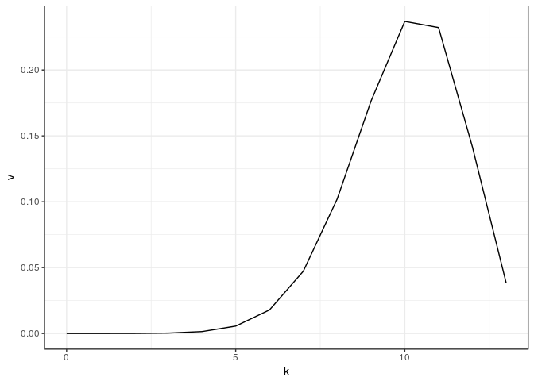

```r
ggplot(tibble(k=0:d, `log(v)`=log(v)), aes(x=k,y=`log(v)`)) +
    geom_line() +
    theme_bw()
```

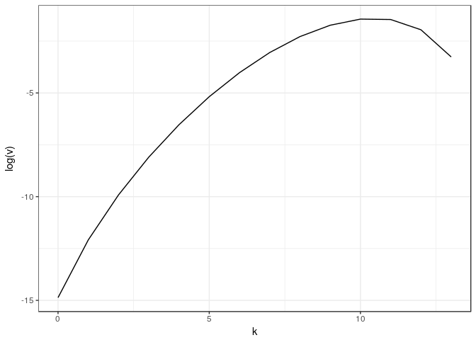

The goal is to reconstruct these values from samples from the bivariate
chi-bar-squared distribution with the above intrinsic volumes as weights.

```r
# set sample size
n <- 10^5
# obtain sample of the specified size
set.seed(1234)
m_samp <- circ_rbichibarsq(n,D,alpha)
# scatter plot of the sample
ggplot(as_tibble(m_samp), aes(V1,V2)) + geom_point(alpha=.02) +
    theme_bw() +
    theme(axis.title.x=element_blank(),axis.title.y=element_blank())
```

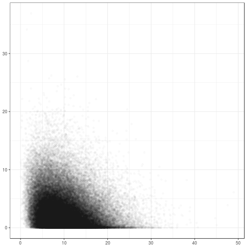

The first and second moment of the intrinsic volumes are given by 9.997
and 2.6516, and estimated from the sample data
as 9.9948 and 2.813,
respectively. These estimates are used to find a first estimate for the intrinsic volumes.

```r
# get the estimated mean and variance of the intrinsic volumes
est <- estimate_statdim_var(d, m_samp)
# get the corresponding initial estimates
v0 <- init_v(d)
v1 <- init_v(d, 1, delta=est$delta, var=est$var)
v2 <- init_v(d, 2, delta=est$delta)
v3 <- init_v(d, 3, delta=est$delta, var=est$var)
v4 <- init_v(d, 4, delta=est$delta, var=est$var)
init <- tibble(k=0:d, exact=v,   `init_mode=0`=v0, `init_mode=1`=v1,
               `init_mode=2`=v2, `init_mode=3`=v3, `init_mode=4`=v4)
# plot the different estimates and their logarithms
tib_plot <- gather(init,mode,value,2:7)
ggplot(tib_plot, aes(x=k, y=value, color=mode)) +
    geom_line() +
    scale_fill_brewer(palette="Set1") +
    theme_bw()
```

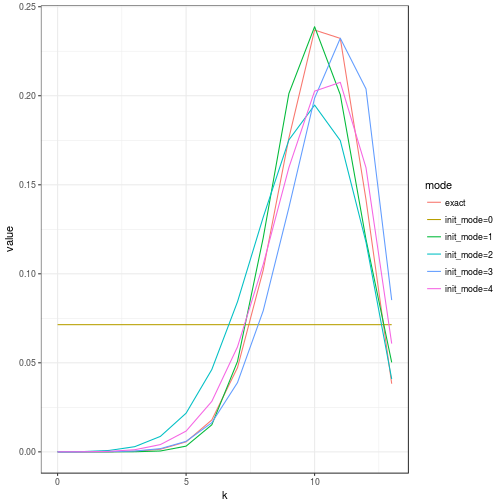

```r
ggplot(tib_plot, aes(x=k, y=log(value), color=mode)) +
    geom_line() +
    scale_fill_brewer(palette="Set1") +
    theme_bw()
```

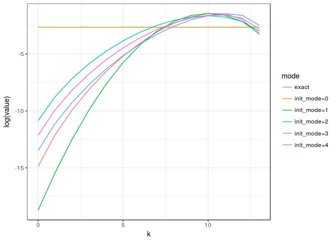

We can look at the log-likelihood of these initial estimates. And since we know the exact values of the underlying intrinsic volumes, we can normalize these values (just to get a convenient y-axis).

```r
# we first need to evaluate the sample data
samp_data <- prepare_data(d, m_samp)
# now we can compute the values of the log-likelihood function and plot the results
tib_loglike = tibble(init_mode=0:4, norm_loglike = c(
            1-comp_loglike(v0, samp_data)/comp_loglike(v, samp_data),
            1-comp_loglike(v1, samp_data)/comp_loglike(v, samp_data),
            1-comp_loglike(v2, samp_data)/comp_loglike(v, samp_data),
            1-comp_loglike(v3, samp_data)/comp_loglike(v, samp_data),
            1-comp_loglike(v4, samp_data)/comp_loglike(v, samp_data)))
ggplot(tib_loglike, aes(init_mode, norm_loglike)) +
    geom_bar(stat="identity") +
    theme_bw()
```

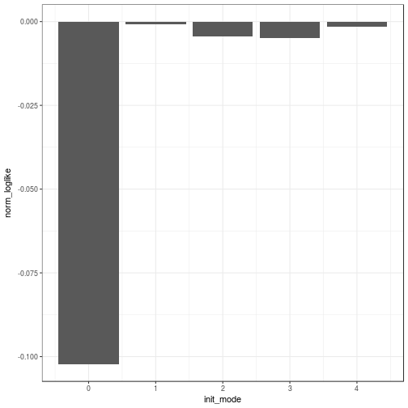

We will take the initial modes 0, 1, 4, and compare the results after 200 iterates of of the expectation maximization (EM) algorithm.

```r
# computing the iterates of the EM algorithm
EM0 <- find_ivols_EM( d, m_samp, N=200, init_mode=0, data=samp_data)
EM1 <- find_ivols_EM( d, m_samp, N=200, init_mode=1, data=samp_data)
EM4 <- find_ivols_EM( d, m_samp, N=200, init_mode=4, data=samp_data)
# plotting some iterates of initial mode == 0
tib_exact <- tibble( k=0:d, exact=v)
tib_plot0 <- as_tibble( t(EM0$iterates[1+20*(0:10), ]) ) %>%
    add_column(k=0:d,.before=1) %>%
    gather(step,value,2:12)
ggplot(tib_plot0,aes(x=k,y=value,color=step)) +
    geom_line() +
    geom_line(data=tib_exact,aes(x=k,y=exact),colour="black",linetype="dashed") +
    theme_bw() +
    theme(legend.position="none",
          axis.title.x=element_blank(),
          axis.title.y=element_blank())
```

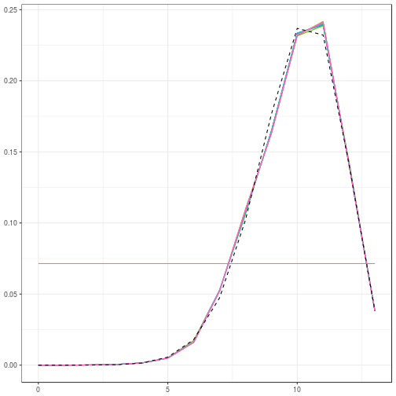

```r
# plotting some iterates of initial mode == 1 and 4
# [...]
```
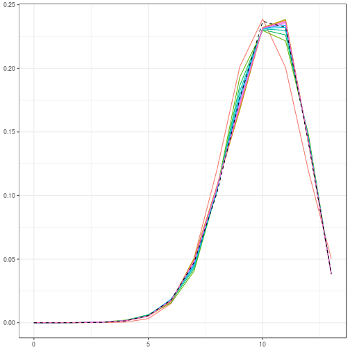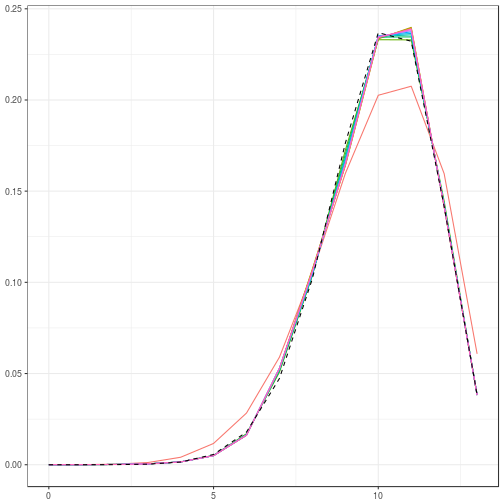

To see the other end of the spectrum we also look at the iterates of the logarithms.
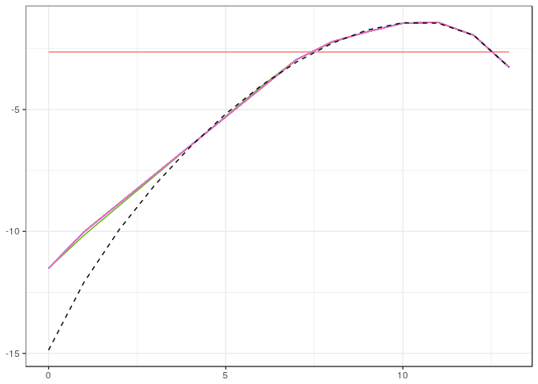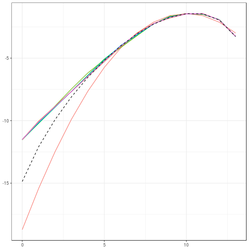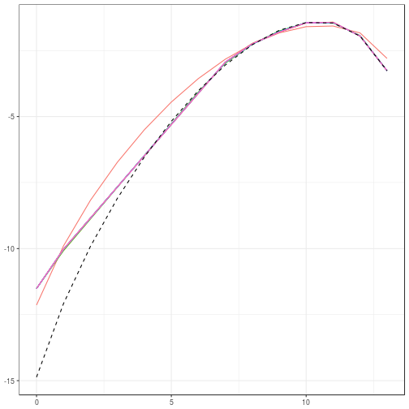

We can see that the estimate after 200 iterations is quite accurate for the bigger values, but still comparably poor for the smaller values. If we increase the sample size to 10^6, we can see that the algorithm converges well.

```r
# set sample size
n <- 10^6
# obtain sample of the specified size
set.seed(1234)
m_samp <- circ_rbichibarsq(n,D,alpha)
EM <- find_ivols_EM( d, m_samp, N=200 )
# [...]
```
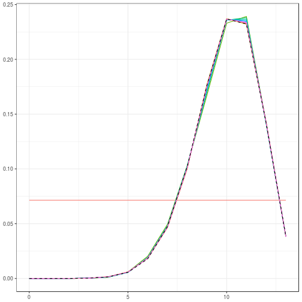

As a final remark, the algorithm uses some bias, which strictly speaking relies (in the general case) on some open conjecture ([log-concavity](https://en.wikipedia.org/wiki/Logarithmically_concave_function) of the intrinsic volumes). The amount to which the algorithm relies on this conjecture can be tuned through the function parameters (it can be completely abandoned). See [this vignette](vignettes/estim-conic-intrinsic-volumes-with-EM.html) for a more exhaustive example, which goes into more details of this parameter tuning.


