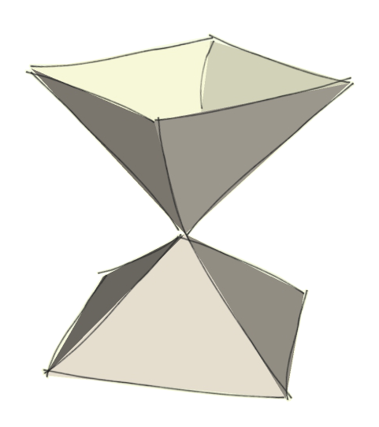
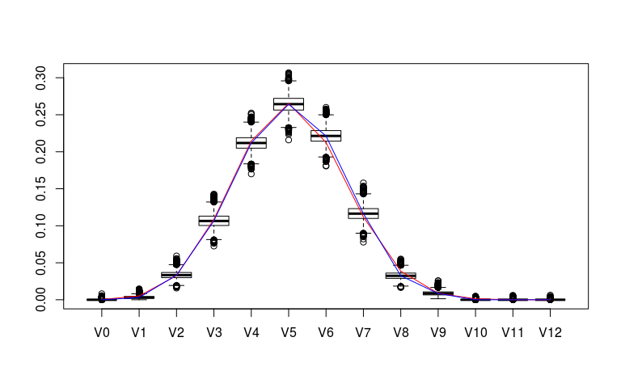
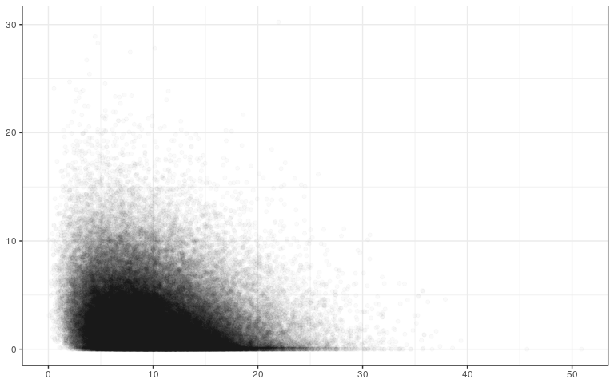
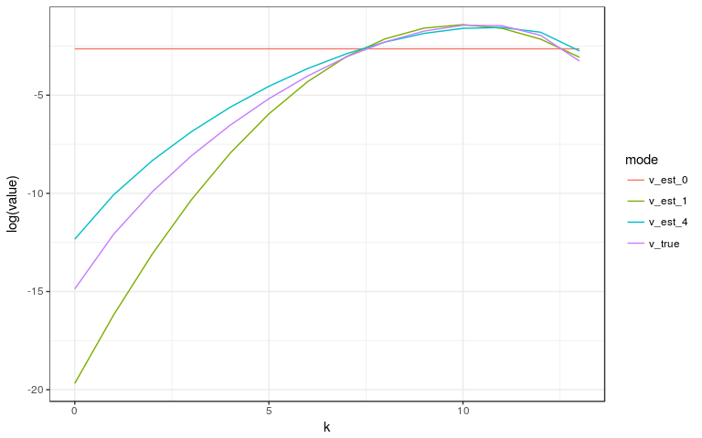
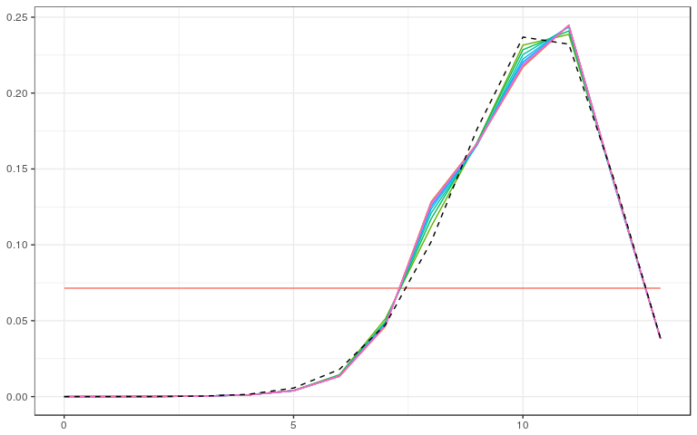
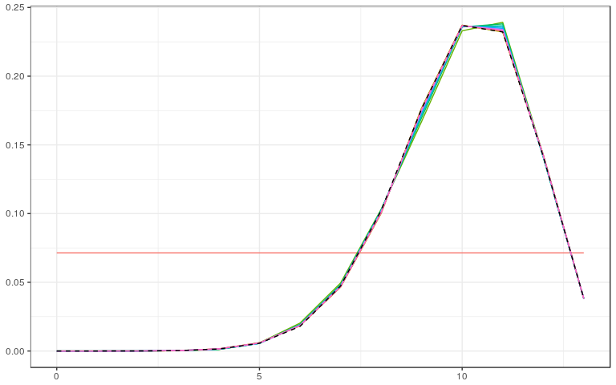
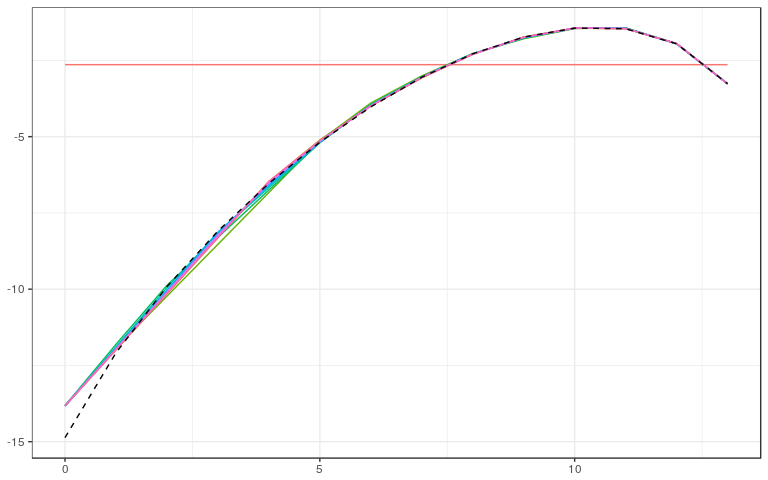

<!-- README.md is generated from README.Rmd. Please edit that file -->
conivol: An R package for the (bivariate) chi-bar-squared distribution and conic intrinsic volumes
==============================================================================================================================================================

This R package provides functions for the chi-bar-squared distribution, the bivariate chi-bar-squared distribution, and the conic intrinsic volumes. It supports standard functions for the density/cdf/sampling of the (bivariate) chi-bar-squared distribution, calculations and known formulas for special classes of intrinsic volumes of cones, sampling functions for ellipsoidal cones and general polyhedral cones, as well as functions for estimating intrinsic volumes either from direct samples of the intrinsic volumes distribution (in the case of polyhedral cones) or from samples of the corresponding bivariate chi-bar-squared distribution. The package supports point estimates as well as Bayesian estimates via JAGS and Stan.

Installation
------------

You can install `conivol` from github with:

``` r
# install.packages("devtools")
devtools::install_github("damelunx/conivol")
```

Vignettes
---------

The following vignettes introduce the theory of intrinsic volumes, explain the idea behind the algorithm to reconstruct the intrinsic volumes from samples of the bivariate chi-bar-squared distribution, and the Bayesian approach to this reconstruction:

-   [Conic intrinsic volumes and (bivariate) chi-bar-squared distribution](articles/conic-intrinsic-volumes.html): introduces conic intrinsic volumes and (bivariate) chi-bar-squared distributions, as well as the computations involving polyhedral cones,
-   [Estimating conic intrinsic volumes from bivariate chi-bar-squared data](articles/estim-conic-intrinsic-volumes-with-EM.html): describes the details of the algorithm for finding the intrinsic volumes of closed convex cones from samples of the associated bivariate chi-bar-squared distribution,
-   [Bayesian estimates for conic intrinsic volumes](articles/bayesian.html): describes the Bayesian approach for reconstructing intrinsic volumes from sampling data, which can either be samples from the intrinsic volumes distribution (in the case of polyhedral cones), or from the bivariate chi-bar-squared distribution, and which can be with or without enforcing log-concavity of the intrinsic volumes.

Functions
---------

In the following we list up the functions that are exported in the package (sorted by context), and include some examples to illustrate their use. See the above vignettes for more details about the underlying theory and algorithms.

### (Bivariate) Chi-bar-squared distribution:

`conivol` provides the standard support of the distributions (chi-bar-squared and bivariate chi-bar-squared) in the form of functions for the densities, cumulative distribution functions, and sampling methods:

-   `dchibarsq`, `dbichibarsq`: evaluate the densities of (bivariate) chi-bar-squared distributions,
-   `pchibarsq`, `pbichibarsq`: evaluate the dumulative distribution functions of (bivariate) chi-bar-squared distributions,
-   `rchibarsq`, `rbichibarsq`: produce samples of the (bivariate) chi-bar-squared distributions.

**Usage:**

``` r
# vector of weights
v <- rep(1,8)/8

# points to evaluate densities/cdfs (in the bavariate case two-column matrix)
x <- 0:10
xmat <- matrix(c(0:10,0:10),ncol=2)

# evaluate densities
dchibarsq(x, v)
#>  [1]        Inf 0.13419199 0.12061209 0.10708571 0.09155903 0.07548244
#>  [7] 0.06030318 0.04691767 0.03569914 0.02665556 0.01958501
dbichibarsq(xmat, v)
#>  [1]          Inf 0.0175809440 0.0182933272 0.0123633200 0.0070024293
#>  [6] 0.0036001390 0.0017409915 0.0008070907 0.0003627570 0.0001592392
#> [11] 0.0000686107

# evaluate cdfs
pchibarsq(x, v)
#>  [1] 0.1250000 0.3027630 0.4297465 0.5437900 0.6432281 0.7267271 0.7944988
#>  [8] 0.8479373 0.8890605 0.9200628 0.9430303
pbichibarsq(xmat, v)
#>  [1] 0.000000000 0.001292866 0.010039908 0.028749442 0.055055648
#>  [6] 0.085009193 0.115062662 0.142780036 0.166851524 0.186835988
#> [11] 0.202856633

# draw samples
rchibarsq(10,v)
#>  [1] 11.7136793  1.8455705  0.3968663  4.2529728 11.9379648  1.6168339
#>  [7] 12.4645588  4.1396592 12.1570490  1.3374971
rbichibarsq(10,v)
#>            [,1]         [,2]
#>  [1,]  9.158176 0.6671769752
#>  [2,]  4.653150 0.3943444343
#>  [3,]  3.511411 0.2112598458
#>  [4,]  0.325022 9.4584050842
#>  [5,]  3.512931 0.5548743991
#>  [6,]  5.933315 0.0000000000
#>  [7,]  0.000000 1.2225380465
#>  [8,]  1.065171 3.0144153644
#>  [9,] 10.853338 2.4789997414
#> [10,]  6.457394 0.0005752294
```

### Special classes of cones:

Some special classes of cones admit a direct computation of intrinsic volumes or a particularly simple sampling procedure for the bivariate chi-bar-squared distribution. These situations are covered by the following functions:

-   `prod_ivols`: computes the intrinsic volumes of a product cone by convolving the intrinsic volumes of its elements,
-   `circ_ivols`: computes the intrinsic volumes of (a product of) circular cones,
-   `ellips_semiax`, `ellips_rbichibarsq`: computes the semiaxes / produces samples from the bivariate chi-bar-squared distribution of an ellipsoidal cone,
-   `weyl_matrix`, `weyl_ivols`: computes a matrix representation / computes the intrinsic volumes of (a product of) Weyl chambers.

It is worth pointing out that with the class of direct product of Weyl chambers we obtain an interesting family of cones for which we have exact formulas; the same remark applies to the family of direct products of circular cones. We will use these functions to test the reconstruction algorithms. Ellipsoidal cones do not admit (simple) direct calculations of its intrinsic volumes.

**Usage:**

``` r
# the intrinsic volumes of the 4-dimensional circular cone of radius pi/4 a.k.a. Lorentz cone
circ_ivols(4,pi/4)
#> [1] 0.09084506 0.25000000 0.31830989 0.25000000 0.09084506

# the intrinsic volumes of the direct product of two 4-dimensional Lorentz cones
prod_ivols( list(circ_ivols(4,pi/4), circ_ivols(4,pi/4)) )
#> [1] 0.008252824 0.045422528 0.120333759 0.204577472 0.242826832 0.204577472
#> [7] 0.120333759 0.045422528 0.008252824

# computing the semiaxes of the ellipsoidal cone given by the linear image of the Lorentz cone
A <- matrix(sample(1:25),5,5)
ellips_semiax(A)
#> [1] 8.39031851 3.13814421 1.96798247 0.05006629

# draw samples of the bivariate chi-bar-squared distribution of the ellipsoidal cone
ellips_rbichibarsq(10, A)
#> $semiax
#> [1] 8.39031851 3.13814421 1.96798247 0.05006629
#> 
#> $samples
#>               [,1]        [,2]
#>  [1,] 0.2660257383 2.435511490
#>  [2,] 1.4165146338 0.987217591
#>  [3,] 0.0001986938 6.127696113
#>  [4,] 2.8067142466 0.006943965
#>  [5,] 0.9298638137 0.863948449
#>  [6,] 0.5425539061 2.533520675
#>  [7,] 5.0078025450 1.865901620
#>  [8,] 2.8754255165 0.013595918
#>  [9,] 2.3327089870 3.072222151
#> [10,] 2.3602207583 0.659725270

# compute the matrix of the product of some Weyl chambers
weyl_matrix( rep(3,4), c("BC","BCp","D","Dp"), product=TRUE)
#>       [,1] [,2] [,3] [,4] [,5] [,6] [,7] [,8] [,9] [,10] [,11] [,12]
#>  [1,]   -1    1    0    0    0    0    0    0    0     0     0     0
#>  [2,]    0   -1    1    0    0    0    0    0    0     0     0     0
#>  [3,]    0    0   -1    0    0    0    0    0    0     0     0     0
#>  [4,]    0    0    0    1    0    0    0    0    0     0     0     0
#>  [5,]    0    0    0    1    1    0    0    0    0     0     0     0
#>  [6,]    0    0    0    1    1    1    0    0    0     0     0     0
#>  [7,]    0    0    0    0    0    0   -1    1    0     0     0     0
#>  [8,]    0    0    0    0    0    0   -1   -1    1     0     0     0
#>  [9,]    0    0    0    0    0    0    0    0   -1     0     0     0
#> [10,]    0    0    0    0    0    0    0    0    0     1    -1     0
#> [11,]    0    0    0    0    0    0    0    0    0     1     1     0
#> [12,]    0    0    0    0    0    0    0    0    0     1     1     1

# compute the corresponding intrinsic volumes of the above cone
weyl_ivols( rep(3,4), c("BC","BCp","D","Dp"), product=TRUE)
#>  [1] 6.781684e-05 1.245569e-03 9.691780e-03 4.227024e-02 1.151364e-01
#>  [6] 2.064842e-01 2.502080e-01 2.064842e-01 1.151364e-01 4.227024e-02
#> [11] 9.691780e-03 1.245569e-03 6.781684e-05
```

### General polyhedral cones:

For polyhedral cones we can sample directly from the intrinsic volumes distribution by determining the dimension of the face containing the projection of a random Gaussian vector. Since the result of such a sampling is just a draw from the multinomial distribution, the Bayesian posterior for a Dirichlet prior can be computed analytically. If a more complicated model is used that enforces log-concavity of the intrinsic volumes, then this cannot be solved analytically, but its posterior distribution can still be sampled from via Monte-Carlo methods. The following functions support these computations:

-   `polyh_reduce_gen`, `polyh_reduce_ineq`: compute a reduced representation of a polyhedral cone given by generators / inequalities,
-   `polyh_rivols_gen`, `polyh_rivols_ineq`: produce samples from the intrinsic volumes distribution of a polyhedral cone given by generators / inequalities,
-   `polyh_rbichibarsq_gen`, `polyh_rbichibarsq_ineq`: produce samples from the bivariate chi-bar-squared distribution with weights given by the conic intrinsic volumes of a polyhedral cone given by generators / inequalities,
-   `polyh_bayes`: generates functions for computing quantiles of marginals of the posterior distribution and for sampling from the posterior distribution, given samples of the intrinsic volumes distribution (based on analytic solution),
-   `polyh_stan`: generates inputs for Stan (data list and model string or external file) for sampling from the posterior distribution, given samples of the intrinsic volumes distribution using a model that naturally implies log-concavity (and cannot be solved analytically).

**Usage:**

``` r
# finding the reduced form of some odd polyhedral cone
A <- matrix(1:35, 5, 7)
polyh_reduce_gen(A)
#> $dimC
#> [1] 2
#> 
#> $linC
#> [1] 0
#> 
#> $QL
#> [1] NA
#> 
#> $QC
#>            [,1]       [,2]
#> [1,] -0.4084634 -0.6581472
#> [2,] -0.4274357 -0.3424890
#> [3,] -0.4464080 -0.0268309
#> [4,] -0.4653803  0.2888272
#> [5,] -0.4843526  0.6044853
#> 
#> $A_reduced
#>           [,1]       [,2]
#> [1,] -6.885843 -73.847043
#> [2,]  2.754118  -1.270518
polyh_reduce_ineq(A)
#> $dimC
#> [1] 5
#> 
#> $linC
#> [1] 3
#> 
#> $QL
#> [1] NA
#> 
#> $QC
#>            [,1]       [,2]
#> [1,] -0.4084634 -0.6581472
#> [2,] -0.4274357 -0.3424890
#> [3,] -0.4464080 -0.0268309
#> [4,] -0.4653803  0.2888272
#> [5,] -0.4843526  0.6044853
#> 
#> $A_reduced
#>           [,1]       [,2]
#> [1,] -6.885843 -73.847043
#> [2,]  2.754118  -1.270518

# sampling from the intrinsic volumes distributions
# (setting reduce to FALSE since otherwise polyh_reduce_*** would be called)
polyh_rivols_gen(10, A, reduce=FALSE)
#> $samples
#>  [1] 0 1 0 1 1 1 1 1 1 0
#> 
#> $multsamp
#> [1] 3 7 0 0 0 0
polyh_rivols_ineq(10, A, reduce=FALSE)
#> $samples
#>  [1] 4 3 5 4 5 5 4 4 3 5
#> 
#> $multsamp
#> [1] 0 0 0 2 4 4

# computing the Bayesian posterior with Dirichlet prior (analytically solvable)
# we sample from a product of Weyl chambers to have the true values at hand

W      <- weyl_matrix( rep(4,3), c("BC","D","Dp"), product=TRUE)
v_true <- weyl_ivols(  rep(4,3), c("BC","D","Dp"), product=TRUE)
out <- polyh_rivols_ineq(1e3, W)

# evaluate posterior distribution
bayes_est <- polyh_bayes( out$multsamp, out$dimC, out$linC )

# compare posterior median with true values
v_est_med <- bayes_est$post_marg_quant(0:12,0.5)
v_est_med / v_true
#>  [1] 0.014347632 0.561701529 0.951341821 0.989484391 0.947710174
#>  [6] 0.946117581 1.071471519 1.163783356 0.950920886 0.806530482
#> [11] 0.003950155 0.108555516 1.506501407
sum( (v_est_med-v_true)^2 )
#> [1] 0.0009137502

# display boxplot of posterior distribution, overlayed with true values
data <- as.data.frame( bayes_est$post_samp(1e4) )
colnames(data) <- paste0(rep("V",13),as.character(0:12))
boxplot( value~key, gather( data, factor_key=TRUE ) )
lines(1+0:12, v_true, col="red")
lines(1+0:12, v_est_med, col="blue")
```



``` r
# the Bayesian approach using a model that induces log-concavity works with
# the HMC sampler Stan; see the vignette on the Bayesian estimates for an example
```

### Estimating the weights of the bivariate chi-bar-squared distribution:

When the cone is nonpolyhedral or when sampling from the intrinsic volumes distribution is infeasible (due to high dimensions or numerical issues), one may still try to recover the intrinsic volumes from samples of the bivariate chi-bar-squared distribution. The following functions support estimating the first two moments of the intrinsic volumes distribution and finding coarse estimates from these moments, and finding the maximum likelihood estimate via expectation-maximization. `conivol` also supports using the samplers JAGS and Stan to analyze the posterior distribution of the intrinsic volumes; see the vignette on Bayes estimates for illustrations of the usage of these functions.

-   `estim_statdim_var`: estimates the statistical dimension and the variance of the intrinsic volumes from samples of the corresponding bivariate chi-bar-squared distribution,
-   `init_ivols`: finds an initial estimate of the weights, potentially based on first and/or second moment,
-   `loglike_ivols`: computes the log-likelihood of a weight vector for specific sample data
-   `prepare_em`: evaluates the sample data of the bivariate chi-bar-squared data (find the corresponding chi-squared density values),
-   `estim_em`: produces EM-type iterates that may or may not converge to the maximum likelihood estimate for the weights of the bivariate chi-bar-squared distribution from sample data
-   `estim_jags`, `estim_stan`: generate inputs for JAGS / Stan (data list and model string or external file) for sampling from the posterior distribution of the intrinsic volumes, given samples of the bivariate chi-bar-squared distribution

**Usage:** We use a sample from the bivariate chi-bar-squared distribution of a product of circular cones, for which we have exact formulas for its intrinsic volumes:

``` r
v_true <- circ_ivols( c(5,8), c(0.7*pi/2, 0.8*pi/2), product=TRUE)
m_samp <- rbichibarsq(1e5, v_true)
d <- 13
# scatter plot of the sample
ggplot(as_tibble(m_samp), aes(V1,V2)) + geom_point(alpha=.02) +
    theme_bw() +
    theme(axis.title.x=element_blank(),axis.title.y=element_blank())
```



``` r
# estimate the moments of the intrinsic volumes, compare with true values
est <- estim_statdim_var(d, m_samp); est
#> $delta
#> [1] 10.00048
#> 
#> $var
#> [1] 2.485597
list( statdim_true=sum((0:d)*v_true),
      var_true=sum((0:d)^2*v_true)-sum((0:d)*v_true)^2 )
#> $statdim_true
#> [1] 9.997038
#> 
#> $var_true
#> [1] 2.651605

# prepare data for computing log-likelihoods and for EM estimate
data <- prepare_em(d, m_samp)

# find initial estimates of intrinsic volumes based on moments
v_init <- tibble( v_est_0 = init_ivols(13,0),
                  v_est_1 = init_ivols(13,1,est$delta,est$var),
                  v_est_4 = init_ivols(13,4,est$delta,est$var) )

# compute log-likelihoods of initial estimates
lapply( v_init, loglike_ivols, data, 0)
#> $v_est_0
#> [1] -5.475552
#> 
#> $v_est_1
#> [1] -4.966583
#> 
#> $v_est_4
#> [1] -4.974373
# plot the different estimates and their logarithms
tib_plot <- v_init %>% add_column(v_true=v_true,.before=1) %>%
    add_column(k=0:d,.before=1) %>% gather(mode,value,2:5)
ggplot(tib_plot, aes(x=k, y=value, color=mode)) +
    geom_line() + theme_bw()
```


``` r
ggplot(tib_plot, aes(x=k, y=log(value), color=mode)) +
    geom_line() + theme_bw()
```



We compute some iterates of the EM algorithm for different initial estimates:

``` r
em0 <- estim_em( d, m_samp, N=200, init_mode=0, data=data)
em1 <- estim_em( d, m_samp, N=200, init_mode=1, data=data)
em4 <- estim_em( d, m_samp, N=200, init_mode=4, data=data)

# plotting some iterates of initial mode == 0, 1, 4
tib_true <- tibble( k=0:d, v_true=v_true )
tib_plot0 <- as_tibble( t(em0$iterates[1+20*(0:10), ]) ) %>%
    add_column(k=0:d,.before=1) %>% gather(step,value,2:12)
ggplot(tib_plot0,aes(x=k,y=value,color=step)) +
    geom_line() + theme_bw() +
    geom_line(data=tib_true,aes(x=k,y=v_true),colour="black",linetype="dashed") +
    theme(legend.position="none", axis.title.x=element_blank(), axis.title.y=element_blank())
# [...]
```

<!-- ```{r plot-em-iterates, echo=FALSE, fig.width=8, fig.height=5, fig.align="center"} -->
<!-- ggplot(tib_plot0,aes(x=k,y=log(value),color=step)) + -->
<!--     geom_line() + theme_bw() + -->
<!--     geom_line(data=tib_true,aes(x=k,y=log(v_true)),colour="black",linetype="dashed") + -->
<!--     theme(legend.position="none", axis.title.x=element_blank(), axis.title.y=element_blank()) -->
<!-- tib_plot1 <- as_tibble( t(em0$iterates[1+20*(0:10), ]) ) %>% -->
<!--     add_column(k=0:d,.before=1) %>% gather(step,value,2:12) -->
<!-- ggplot(tib_plot1,aes(x=k,y=value,color=step)) + -->
<!--     geom_line() + theme_bw() + -->
<!--     geom_line(data=tib_true,aes(x=k,y=v_true),colour="black",linetype="dashed") + -->
<!--     theme(legend.position="none", axis.title.x=element_blank(), axis.title.y=element_blank()) -->
<!-- ggplot(tib_plot1,aes(x=k,y=log(value),color=step)) + -->
<!--     geom_line() + theme_bw() + -->
<!--     geom_line(data=tib_true,aes(x=k,y=log(v_true)),colour="black",linetype="dashed") + -->
<!--     theme(legend.position="none", axis.title.x=element_blank(), axis.title.y=element_blank()) -->
<!-- tib_plot4 <- as_tibble( t(em0$iterates[1+20*(0:10), ]) ) %>% -->
<!--     add_column(k=0:d,.before=1) %>% gather(step,value,2:12) -->
<!-- ggplot(tib_plot4,aes(x=k,y=value,color=step)) + -->
<!--     geom_line() + theme_bw() + -->
<!--     geom_line(data=tib_true,aes(x=k,y=v_true),colour="black",linetype="dashed") + -->
<!--     theme(legend.position="none", axis.title.x=element_blank(), axis.title.y=element_blank()) -->
<!-- ggplot(tib_plot4,aes(x=k,y=log(value),color=step)) + -->
<!--     geom_line() + theme_bw() + -->
<!--     geom_line(data=tib_true,aes(x=k,y=log(v_true)),colour="black",linetype="dashed") + -->
<!--     theme(legend.position="none", axis.title.x=element_blank(), axis.title.y=element_blank()) -->
<!-- ``` -->


We can see that the estimate after 200 iterations is quite accurate for the larger values, but still comparably poor for the smaller values. If we increase the sample size to 10^6, we can see that the algorithm converges well.



<!-- saved the output of the R code below (takes a few minutes) -->
<!-- ```{r em-large-sample, fig.width=8, fig.height=5, fig.align="center"} -->
<!-- # obtain large sample -->
<!-- set.seed(1234) -->
<!-- m_samp_large <- rbichibarsq(1e6, v_true) -->
<!-- em <- estim_em( d, m_samp_large, N=200 ) -->
<!-- tib_plot <- as_tibble( t(em$iterates[1+20*(0:10), ]) ) %>% -->
<!--     add_column(k=0:d,.before=1) %>% gather(step,value,2:12) -->
<!-- ggplot(tib_plot,aes(x=k,y=value,color=step)) + -->
<!--     geom_line() + theme_bw() + -->
<!--     geom_line(data=tib_true,aes(x=k,y=v_true),colour="black",linetype="dashed") + -->
<!--     theme(legend.position="none", axis.title.x=element_blank(), axis.title.y=element_blank()) -->
<!-- ggplot(tib_plot,aes(x=k,y=log(value),color=step)) + -->
<!--     geom_line() + theme_bw() + -->
<!--     geom_line(data=tib_true,aes(x=k,y=log(v_true)),colour="black",linetype="dashed") + -->
<!--     theme(legend.position="none", axis.title.x=element_blank(), axis.title.y=element_blank()) -->
<!-- ``` -->
