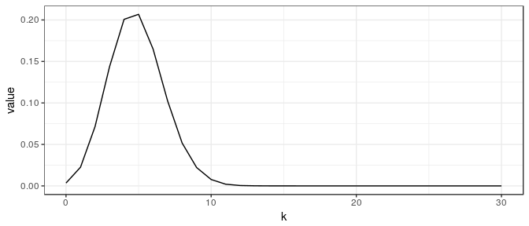
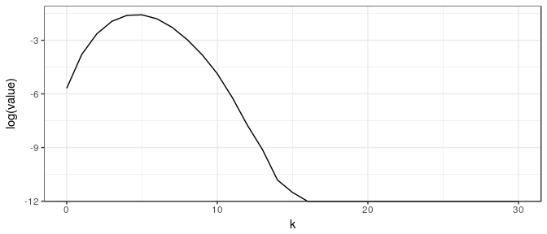
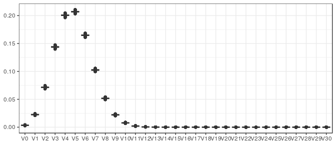

<<<<<<< HEAD
Conic intrinsic volumes and the (bivariate) chi-bar-squared distribution
================
Dennis Amelunxen
2017-11-17


This note introduces the conic intrinsic volumes and the associated (bivariate) chi-bar-squared distributions. The focus is on algorithmic considerations; see the survey paper (Amelunxen and Lotz [2017](#ref-AL17)) and the references therein for more background on the conic intrinsic volumes. We will give further pointers to the literature within the text below.

**Other vignettes:**

-   [Estimating conic intrinsic volumes via EM algorithm](estim-conic-intrinsic-volumes-with-EM.html): describes the details of the algorithm for finding the intrinsic volumes of closed convex cones from samples of the associated bivariate chi-bar-squared distribution,
-   [Bayesian estimates for conic intrinsic volumes](bayesian.html): describes the Bayesian approach for reconstructing intrinsic volumes from sampling data, which can either be samples from the intrinsic volumes distribution (in the case of polyhedral cones), or from the bivariate chi-bar-squared distribution, and which can be with or without enforcing log-concavity of the intrinsic volumes.

Closed convex cones
-------------------

As the name suggests, a closed convex cone *C* ⊆ R<sup>*d*</sup> satisfies the following three properties:

1.  *C* is **closed**:
    the limit of any convergent sequence is an element of *C*,
    ∀*x*<sub>1</sub>, *x*<sub>2</sub>, … ∈ *C* such that lim<sub>*i* → ∞</sub>*x*<sub>*i*</sub> exists : lim<sub>*i* → ∞</sub>*x*<sub>*i*</sub> ∈ *C*
2.  *C* is **convex**:
    any convex combination of elements in *C* lies in *C*,
    ∀*x*, *y* ∈ *C*,  0 ≤ *λ* ≤ 1 : *λ**x* + (1 − *λ*)*y* ∈ *C*
3.  *C* is a **cone**:
    any positive scaling of an element in *C* lies in *C*,
    ∀*x* ∈ *C* , *λ* &gt; 0 : *λ**x* ∈ *C*

Properties 1. and 3. imply that every nonzero closed cone contains the origin, 0 ∈ *C*. Furthermore, if 0 ∈ *C*, then properties 2. and 3. taken together are equivalent to the property
∀*x*, *y* ∈ *C*,  *λ*, *μ* ≥ 0 : *λ**x* + *μ**y* ∈ *C*
 In other words, a (nonempty) closed convex cone is a closed set, which is **closed under nonnegative linear combinations**. Compare this to linear subspaces which can be characterized through their closedness under (possibly negative) linear combinations.

**Note:**

-   Below we will always assume that closed convex cones are nonempty, hence, they contain at least the origin.
-   If *C* ⊆ R<sup>*d*</sup> and *D* ⊆ R<sup>*e*</sup> are closed convex cones, then their direct product is a closed convex cone, *C* × *D* ⊆ R<sup>*d* + *e*</sup>.

### Polar cones

Every closed convex cone *C* ⊆ R<sup>*d*</sup> defines a natural counterpart, its polar cone
*C*<sup>∘</sup> := {*y* ∈ R<sup>*d*</sup> ∣ ∀*x* ∈ *C* : *x*<sup>*T*</sup>*y* ≤ 0}.
 The polar cone is also a closed convex cone, and the polar of the polar cone is the original cone, which in this context is also called the primal cone, (*C*<sup>∘</sup>)<sup>∘</sup> = *C*. It thus makes sense to think about the primal cone and its polar cone as a primal-polar pair of cones. A cone is called self-dual, if *C*<sup>∘</sup> = −*C*.

Note that (R<sup>*d*</sup>)<sup>∘</sup> = {0}. Also, polarity behaves well with direct products, (*C* × *D*)<sup>∘</sup> = *C*<sup>∘</sup> × *D*<sup>∘</sup>.
The polar cone depends on the ambient space, i.e., if we embed *C* ⊆ R<sup>*d*</sup> in R<sup>*e*</sup>, *e* ≥ *d*, by formally identifying *C* with *C* × {0}⊆R<sup>*e*</sup>, then the polar of the embedded cone is given by (*C* × {0})<sup>∘</sup> = *C*<sup>∘</sup> × R<sup>*e* − *d*</sup> (as opposed to the polar of *C* in R<sup>*d*</sup> embedded in R<sup>*e*</sup>).

If the cone *C* is transformed by an invertible linear transformation then its polar cone is transformed by the transpose of the inverse of the transformation:
$$ (AC)^\\circ = B^T C^\\circ ,\\qquad \\text{if $A$ invertible and } B=A^{-1} . $$

### Dimension and lineality

The smallest linear space containing a cone *C* is given by *C* + ( − *C*), and the largest linear space contained in *C*, called the lineality space of *C*, is given by *C* ∩ ( − *C*). Linear hull and lineality space are related by polarity, as

*C*<sup>∘</sup> + ( − *C*<sup>∘</sup>)=(*C* ∩ ( − *C*))<sup>⊥</sup>,  *C*<sup>∘</sup> ∩ ( − *C*<sup>∘</sup>)=(*C* + ( − *C*))<sup>⊥</sup>,
 where *L*<sup>⊥</sup> denotes the orthogonal complement of a linear space. Every closed convex cone has the natural orthogonal decomposition
$$ C = L + \\bar C , $$
 where *L* = *C* ∩ ( − *C*) denotes the lineality space, and $\\bar C=\\Pi\_{L^\\bot}(C)$ the image of the projection of *C* onto the orthogonal complement of *L*.

The (linear) dimension of a cone is the dimension of its linear hull, and the lineality of a cone is the dimension of its lineality space,

dim(*C*)=dim(*C* + ( − *C*)),  lin(*C*)=dim(*C* ∩ ( − *C*)).
 Note that by the above polarity statement we have dim(*C*)=*d* − lin(*C*<sup>∘</sup>) and lin(*C*)=*d* − dim(*C*<sup>∘</sup>).

### Examples: linear subspaces

A trivial yet important class of examples of closed convex cones are the linear subspaces. It is easily seen that the polar cone of a linear subspace is just its orthogonal complement. Clearly, a cone is a linear space iff dim(*C*)=lin(*C*).

The intrinsic volumes and (bivariate) chi-bar-squared distributions (see [below](#bivchibarsq)) are in this case equivalent to the dimension of the subspace and the chi-squared distribution (see [below](#bivchibars_cone) for more precise statements).

Furthermore, for cones which are not linear subspaces the intrinsic volumes satisfy an additional linear relation, which is why the algorithms in `conivol` assume that the underlying closed convex cone is **not** a linear subspace.

### Examples: polyhedral cones

Polyhedral cones are a straightforward generalization of linear subspaces and can be described in two ways, which are related via polarity:

1.  as nonnegative linear combinations of a finite number of vectors,
    *C* = {*A**z* ∣ *z* ∈ R<sup>*n*</sup>, *z* ≥ 0}, *A* ∈ R<sup>*d* × *n*</sup>,
     where the inequality *z* ≥ 0 is meant componentwise,
2.  as the intersection of finitely many closed linear half-spaces,
    *C*<sup>∘</sup> = {*y* ∈ R<sup>*d*</sup> ∣ *A*<sup>*T*</sup>*y* ≤ 0}.

Although the set of polyhedral cones does not exhaust the set of closed convex cones, it can be shown (and it is intuitively clear) that every closed convex cone can be arbitrarily well approximated by polyhedral cones.

For later use we recall that a face of a polyhedral cone is the intersection of a linear hyperplane (linear subspace of codimension one) with the cone, where the cone has to lie entirely in one of the two closed half-spaces defined by the hyperplane. Every polyhedral cone has a finite number of faces, and decomposes into the disjoint union of the relative interiors of its faces,
$$ C = \\dot{\\bigcup\_{F\\text{ face of } C}} \\text{relint}(F) .  $$

We can compute the dimension, lineality, the orthogonal decomposition $C=L+\\bar C$, as well as a reduced representation of $\\bar C$ as follows (see (Wets and Witzgall [1967](#ref-WW67)) for more details):

-   The linear hull of *C* can be found through the singular value decomposition (SVD) of *A*; the left-singular vectors will form an orthogonal basis of this space.
-   The lineality space of *C* can be found by each column of *A* whether its negative lies in *C*; the set of these vectors spans the lineality space of *C*, and an orthogonal basis can again be found via SVD.
-   The reduced cone is then found by projecting the remaining vectors on the orthogonal complement of the lineality space.

The function `polyh_reduce_gen` does exactly this. Concretely, for *C* defined as above through the matrix *A*, it finds matrices
$$ Q\_L\\in\\text{R}^{d\\times\\text{lin}(C)} ,
    Q\_C\\in\\text{R}^{d\\times e} ,
    \\tilde A\\in \\text{R}^{e\\times m} , $$
 where *e* = dim(*C*)−lin(*C*), and with *Q*<sub>*L*</sub><sup>*T*</sup>*Q*<sub>*L*</sub> = *I*<sub>lin(*C*)</sub> and *Q*<sub>*C*</sub><sup>*T*</sup>*Q*<sub>*C*</sub> = *I*<sub>*e*</sub>, such that
$$ L=Q\_L\\cdot\\text{R}^{\\text{lin}(C)} ,\\quad
    \\bar C=Q\_C \\{\\tilde A\\tilde z \\mid \\tilde z\\in\\text{R}^m,
    \\tilde z\\geq 0\\} . $$
 In other words, the matrix $\\tilde A$ is a reduced form of the matrix *A* generating (essentially) the same cone as *A*.

If the cone is given by inequalities (as is *C*<sup>∘</sup>; we use a different notation here to avoid confusing notation), like *D* = {*y* ∈ R<sup>*d*</sup> ∣ *A*<sup>*T*</sup>*y* ≤ 0}, then the orthogonal decomposition $D=M+\\bar D$, with *M* denoting the lineality space of *D*, is given as follows:
$$ M=\\{y\\in\\text{R}^d\\mid Q\_L^Ty=0, Q\_C^Ty=0\\} ,\\quad
    \\bar D=Q\_C \\{\\tilde y\\in\\text{R}^e \\mid \\tilde A^T\\tilde y\\leq 0\\}  . $$
 Where $Q\_L, Q\_C, \\tilde A$ are the same matrices as above (returned by `polyh_reduce_gen`); the function `polyh_reduce_ineq` returns these same matrices but with adjusted values for dimension and lineality of the cone (another reason for having two functions doing essentially the same thing is so that the corresponding help pages do not have to cover both cases).

**Example computations:**

``` r
=======
---
title: "Conic intrinsic volumes and the (bivariate) chi-bar-squared distribution"
author: "Dennis Amelunxen"
date: "2017-11-17"
# output: html_vignette
output: github_document
header-includes:
  - \hypersetup{colorlinks=true, linkcolor=blue, urlcolor=blue, citecolor=blue}
vignette: >
  %\VignetteIndexEntry{Vignette Title}
  %\VignetteEngine{knitr::rmarkdown}
  %\VignetteEncoding{UTF-8}
bibliography: references.bib
link-citations: true
---


This note introduces the conic intrinsic volumes and the associated (bivariate)
chi-bar-squared distributions. The focus is on algorithmic considerations; see
the survey paper [@AL17] and the references therein for more
background on the conic intrinsic volumes.
We will give further pointers to the literature within the text below.


**Other vignettes:**

* [Estimating conic intrinsic volumes via EM algorithm](estim-conic-intrinsic-volumes-with-EM.html):
    describes the details of the algorithm for finding the intrinsic volumes of closed
    convex cones from samples of the associated bivariate chi-bar-squared distribution,
* [Bayesian estimates for conic intrinsic volumes](bayesian.html):
    describes the Bayesian approach for reconstructing intrinsic volumes
    from sampling data, which can either be samples from the intrinsic
    volumes distribution (in the case of polyhedral cones), or from the
    bivariate chi-bar-squared distribution, and which can be with or without
    enforcing log-concavity of the intrinsic volumes.


## Closed convex cones

As the name suggests, a closed convex cone $C\subseteq\text{R}^d$ satisfies
the following three properties:  

1. $C$ is **closed**:  
the limit of any convergent sequence is an element of $C$,
  \[ \forall x_1,x_2,\ldots\in C \text{ such that } \lim_{i\to\infty} x_i
    \text{ exists}: \lim_{i\to\infty} x_i\in C \]
2. $C$ is **convex**:  
any convex combination of elements in $C$ lies in $C$,  
  \[ \forall x,y\in C,\; 0\leq \lambda\leq 1 : \lambda x+(1-\lambda) y\in C \]
3. $C$ is a **cone**:  
any positive scaling of an element in $C$ lies in $C$,
  \[ \forall x\in C\;,\lambda>0 : \lambda x\in C \]

Properties 1. and 3. imply that every nonzero closed cone contains the origin,
$0\in C$. Furthermore, if $0\in C$, then properties 2. and 3. taken together
are equivalent to the property
  \[ \forall x,y\in C,\; \lambda,\mu\geq0 : \lambda x+\mu y\in C \]
In other words, a (nonempty) closed convex cone is a closed set, which is
**closed under nonnegative linear combinations**. Compare this to linear
subspaces which can be characterized through their closedness under
(possibly negative) linear combinations.

**Note:**

* Below we will always assume that closed convex cones are nonempty, hence,
they contain at least the origin.
* If $C\subseteq\text{R}^d$ and $D\subseteq\text{R}^e$ are closed
convex cones, then their direct product is a closed convex cone,
$C\times D\subseteq\text{R}^{d+e}$.

### Polar cones

Every closed convex cone $C\subseteq\text{R}^d$ defines a natural counterpart,
its polar cone
  \[ C^\circ := \{y\in\text{R}^d\mid \forall x\in C: x^Ty\leq 0\} . \]
The polar cone is also a closed convex cone, and the polar of the polar cone
is the original cone, which in this context is also called the primal cone,
$(C^\circ)^\circ = C$. It thus makes sense to think about the primal cone and
its polar cone as a primal-polar pair of cones. A cone is called self-dual,
if $C^\circ=-C$.  

Note that $(\text{R}^d)^\circ=\{0\}$. Also, polarity behaves well with direct
products, $(C\times D)^\circ = C^\circ\times D^\circ$.  
The polar cone depends on the ambient space, i.e., if we embed
$C\subseteq\text{R}^d$ in $\text{R}^e$, $e\geq d$, by formally identifying $C$
with $C\times\{0\}\subseteq\text{R}^e$, then the polar of the embedded cone
is given by $(C\times\{0\})^\circ = C^\circ\times\text{R}^{e-d}$ (as opposed
to the polar of $C$ in $\text{R}^d$ embedded in $\text{R}^e$).

If the cone $C$ is transformed by an invertible linear transformation then
its polar cone is transformed by the transpose of the inverse of the
transformation:
  \[ (AC)^\circ = B^T C^\circ ,\qquad \text{if $A$ invertible and } B=A^{-1} . \]

### Dimension and lineality {#dim_lin}

The smallest linear space containing a cone $C$ is given by $C+(-C)$, and
the largest linear space contained in $C$, called the lineality space of $C$,
is given by $C\cap (-C)$. Linear hull and lineality space are related by
polarity, as

  \[ C^\circ+(-C^\circ) = (C\cap (-C))^\bot ,\quad C^\circ\cap(-C^\circ) = (C+(-C))^\bot , \]
where $L^\bot$ denotes the orthogonal complement of a linear space. Every
closed convex cone has the natural orthogonal decomposition
  \[ C = L + \bar C , \]
where $L=C\cap (-C)$ denotes the lineality space, and $\bar C=\Pi_{L^\bot}(C)$
the image of the projection of $C$ onto the orthogonal complement of $L$.

The (linear) dimension of a cone is the dimension of its linear hull, and the
lineality of a cone is the dimension of its lineality space,

  \[ \text{dim}(C) = \text{dim}(C+(-C)) ,\quad \text{lin}(C) = \text{dim}(C\cap(-C)) . \]
Note that by the above polarity statement we have
$\text{dim}(C)=d-\text{lin}(C^\circ)$ and $\text{lin}(C)=d-\text{dim}(C^\circ)$.

### Examples: linear subspaces

A trivial yet important class of examples of closed convex cones are the
linear subspaces. It is easily seen that the polar cone of a linear
subspace is just its orthogonal complement. Clearly, a cone is a linear
space iff $\text{dim}(C)=\text{lin}(C)$.  

The intrinsic volumes and (bivariate) chi-bar-squared distributions
(see [below](#bivchibarsq)) are in this case equivalent to the dimension
of the subspace and the chi-squared distribution
(see [below](#bivchibars_cone) for more precise statements).  

Furthermore, for cones which are not linear subspaces the intrinsic
volumes satisfy an additional linear relation, which is why the algorithms
in `conivol` assume that the underlying closed convex cone is **not**
a linear subspace.

### Examples: polyhedral cones {#polyh_cones}

Polyhedral cones are a straightforward generalization of linear subspaces
and can be described in two ways, which are related via polarity:

1. as nonnegative linear combinations of a finite number of vectors,
  \[ C = \{Az \mid z\in\text{R}^n, z\geq 0\} ,\quad A\in\text{R}^{d\times n} , \]
where the inequality $z\geq0$ is meant componentwise,
2. as the intersection of finitely many closed linear half-spaces,
  \[ C^\circ = \{y\in\text{R}^d \mid A^Ty\leq 0\} . \]

Although the set of polyhedral cones does not exhaust the set of closed
convex cones, it can be shown (and it is intuitively clear) that every
closed convex cone can be arbitrarily well approximated by polyhedral cones.

For later use we recall that a face of a polyhedral cone is the intersection
of a linear hyperplane (linear subspace of codimension one) with the cone,
where the cone has to lie entirely in one of the two closed half-spaces
defined by the hyperplane. Every polyhedral cone has a finite number of
faces, and decomposes into the disjoint union of the relative interiors
of its faces,
  \[ C = \dot{\bigcup_{F\text{ face of } C}} \text{relint}(F) .  \]

We can compute the dimension, lineality, the orthogonal decomposition $C=L+\bar C$,
as well as a reduced representation of $\bar C$ as follows 
(see [@WW67] for more details):

* The linear hull of $C$ can be found through the singular value decomposition (SVD)
of $A$; the left-singular vectors will form an orthogonal basis of this space.
* The lineality space of $C$ can be found by each column of $A$ whether its negative
lies in $C$; the set of these vectors spans the lineality space of $C$, and an
orthogonal basis can again be found via SVD.
* The reduced cone is then found by projecting the remaining vectors on the
orthogonal complement of the lineality space.

The function `polyh_reduce_gen` does exactly this. Concretely, for $C$ defined
as above through the matrix $A$, it finds matrices
  \[ Q_L\in\text{R}^{d\times\text{lin}(C)} ,
    Q_C\in\text{R}^{d\times e} ,
    \tilde A\in \text{R}^{e\times m} , \]
where $e=\text{dim}(C)-\text{lin}(C)$, and with $Q_L^TQ_L=I_{\text{lin}(C)}$
and $Q_C^TQ_C=I_e$, such that
  \[ L=Q_L\cdot\text{R}^{\text{lin}(C)} ,\quad
    \bar C=Q_C \{\tilde A\tilde z \mid \tilde z\in\text{R}^m,
    \tilde z\geq 0\} . \]
In other words, the matrix $\tilde A$ is a reduced form of the matrix $A$ generating
(essentially) the same cone as $A$.


If the cone is given by inequalities (as is $C^\circ$; we use a different notation
here to avoid confusing notation), like $D=\{y\in\text{R}^d \mid A^Ty\leq 0\}$,
then the orthogonal decomposition $D=M+\bar D$, with $M$ denoting the lineality
space of $D$, is given as follows:
  \[ M=\{y\in\text{R}^d\mid Q_L^Ty=0, Q_C^Ty=0\} ,\quad
    \bar D=Q_C \{\tilde y\in\text{R}^e \mid \tilde A^T\tilde y\leq 0\}  . \]
Where $Q_L, Q_C, \tilde A$ are the same matrices as above (returned by
`polyh_reduce_gen`); the function `polyh_reduce_ineq` returns these same
matrices but with adjusted values for dimension and lineality of the cone
(another reason for having two functions doing essentially the same thing is
so that the corresponding help pages do not have to cover both cases).

**Example computations:**


```r
>>>>>>> f4d99c7a14646ce8993c429d62dfea20276fecb0
A <- matrix(c(-(1:4),1:24),4,7); A
#>      [,1] [,2] [,3] [,4] [,5] [,6] [,7]
#> [1,]   -1    1    5    9   13   17   21
#> [2,]   -2    2    6   10   14   18   22
#> [3,]   -3    3    7   11   15   19   23
#> [4,]   -4    4    8   12   16   20   24
polyh_reduce_gen(A)
#> $dimC
#> [1] 2
#> 
#> $linC
#> [1] 1
#> 
#> $QL
#>            [,1]
#> [1,] -0.1825742
#> [2,] -0.3651484
#> [3,] -0.5477226
#> [4,] -0.7302967
#> 
#> $QC
#>               [,1]
#> [1,]  8.164966e-01
#> [2,]  4.082483e-01
#> [3,]  3.115041e-16
#> [4,] -4.082483e-01
#> 
#> $A_reduced
#> [1] 1
polyh_reduce_ineq(A)
#> $dimC
#> [1] 3
#> 
#> $linC
#> [1] 2
#> 
#> $QL
#>            [,1]
#> [1,] -0.1825742
#> [2,] -0.3651484
#> [3,] -0.5477226
#> [4,] -0.7302967
#> 
#> $QC
#>               [,1]
#> [1,]  8.164966e-01
#> [2,]  4.082483e-01
#> [3,]  3.115041e-16
#> [4,] -4.082483e-01
#> 
#> $A_reduced
#> [1] 1
```

<<<<<<< HEAD
### Examples: simplicial cones and Weyl chambers of finite reflection groups

A special class of polyhedral cones is given by so-called simplicial cones. These are full-dimensional cones with a minimal number of edges and facets. Formally, we can describe these cones as positive orthants transformed by an invertible linear transformation:
{simplicial cones in R<sup>*d*</sup>} = {*A*R<sub>+</sub><sup>*d*</sup> ∣ *A* ∈ R<sup>*d* × *d*</sup> invertible}.
 In other words, a simplicial cone is generated by the columns of an invertible matrix. Note that since the positive orthant is self-dual, (R<sub>+</sub><sup>*d*</sup>)<sup>∘</sup> = −R<sub>+</sub><sup>*d*</sup>, we easily obtain the polar cone of a simplicial cone through the inverse matrix,
$$ \\big( A\\text{R}\_+^d \\big)^\\circ = -B^T\\text{R}\_+^d ,\\qquad
    \\text{if $A$ invertible and } B=A^{-1} . $$

A special class of simplicial cones are the Weyl chambers of finite reflection groups of which the most important ones are of class 'A', 'BC', and 'D'. These chambers are isometric to the following three cones,
=======

### Examples: simplicial cones and Weyl chambers of finite reflection groups {#simpl_weyl}

A special class of polyhedral cones is given by so-called simplicial
cones. These are full-dimensional cones with a minimal number 
of edges and facets. Formally, we can describe these cones as positive
orthants transformed by an invertible linear transformation:
  \[ \big\{\text{simplicial cones in }\text{R}^d\big\}
    = \big\{A\text{R}_+^d\mid A\in\text{R}^{d\times d} \text{ invertible} \big\} . \]
In other words, a simplicial cone is generated by the columns of an
invertible matrix. Note that since the positive orthant is self-dual,
$(\text{R}_+^d)^\circ=-\text{R}_+^d$, we easily obtain the polar cone
of a simplicial cone through the inverse matrix,
  \[ \big( A\text{R}_+^d \big)^\circ = -B^T\text{R}_+^d ,\qquad
    \text{if $A$ invertible and } B=A^{-1} . \]

A special class of simplicial cones are the Weyl chambers of finite
reflection groups of which the most important ones are of class 'A',
'BC', and 'D'. These chambers are isometric to the following three cones,
>>>>>>> f4d99c7a14646ce8993c429d62dfea20276fecb0
\begin{align*}
   C_A & = \big\{ x\in\text{R}^{d+1} \mid x_1 \leq x_2 \leq \dots \leq x_{d+1} \big\} ,
\\ C_{BC} & = \big\{ x\in\text{R}^d \mid 0\leq x_1 \leq x_2 \leq \dots \leq x_d \big\} ,
\\ C_D & = \big\{ x\in\text{R}^d \mid -x_2\leq x_1 \leq x_2 \leq \dots \leq x_d \big\} .
\end{align*}
<<<<<<< HEAD
Note that the first cone is strictly speaking not simplicial, as it contains the one-dimensional linear subspace *L* = {*λ*1<sub>*d*</sub> ∣ *λ* ∈ R}, where 1<sub>*d*</sub> ∈ R<sup>*d*</sup> denotes the all-one vector. However, the projection of *C* onto the orthogonal complement of *L* yields the natural orthogonal decomposition $C\_A=L+\\bar C\_A$, and the projection $\\bar C\_A$ is indeed a simplicial cone. Using the matrix description {*y* ∈ R<sup>*d*</sup> ∣ *A*<sup>*T*</sup>*y* ≤ 0}, we see that the above defined cones correspond to the matrices
=======
Note that the first cone is strictly speaking not simplicial, as it
contains the one-dimensional linear subspace $L=\{\lambda 1_d\mid
\lambda\in\text{R}\}$, where $1_d\in\text{R}^d$ denotes the all-one vector.
However, the projection of $C$ onto the orthogonal complement of $L$ yields
the natural orthogonal decomposition $C_A=L+\bar C_A$, and the projection
$\bar C_A$ is indeed a simplicial cone. Using the matrix description
$\{y\in\text{R}^d \mid A^Ty\leq 0\}$, we see that the above defined
cones correspond to the matrices
>>>>>>> f4d99c7a14646ce8993c429d62dfea20276fecb0
\begin{align*}
   A_A & = \begin{pmatrix}
       1
    \\ -1 & 1
    \\    & \ddots & \ddots
    \\    & & -1 & 1
    \\    & & & -1
    \end{pmatrix} ,
   & A_{BC} & = \begin{pmatrix}
       -1 & 1
    \\    & \ddots & \ddots
    \\    & & -1 & 1
    \\    & & & -1
    \end{pmatrix} ,
   \\ A_D & = \begin{pmatrix}
       -1 & 1
    \\ -1 &-1 & 1
    \\    & & -1 & 1
    \\    & & & \ddots & \ddots
    \\    & & & & -1 & 1
    \\    & & & & & -1
    \end{pmatrix} .
\end{align*}
<<<<<<< HEAD
The truly simplicial cone $\\bar C\_A$ corresponds to the matrix
$$ \\bar A\_A = Q^T A\_A , $$
 where *Q* ∈ R<sup>(*d* + 1)×*d*</sup> is such that its columns form an orthonormal basis of *L*<sup>⊥</sup>.

The polar cones ${C}^\\circ\_A, \\bar C\_A^\\circ, {C}^\\circ\_{BC}, {C}^\\circ\_D$ (the polar cone of $\\bar C\_A^\\circ$ taken in the ambient space *L*<sup>⊥</sup>) correspond to the following matrices:
=======
The truly simplicial cone $\bar C_A$ corresponds to the matrix
  \[ \bar A_A = Q^T A_A , \]
where $Q\in \text{R}^{(d+1)\times d}$ is such that its columns form
an orthonormal basis of $L^\bot$.

The polar cones ${C}^\circ_A, \bar C_A^\circ, {C}^\circ_{BC}, {C}^\circ_D$
(the polar cone of $\bar C_A^\circ$ taken in the ambient space $L^\bot$)
correspond to the following matrices:
>>>>>>> f4d99c7a14646ce8993c429d62dfea20276fecb0
\begin{align*}
   {A}^\circ_A & = \begin{pmatrix}
       -1 & 1 & -d & -d+1 & \dots & -1
    \\ -1 & 1 & 1 & -d+1 & & \vdots
    \\ -1 & 1 & 1 & 2 & \ddots & -1
    \\ \vdots & \vdots & \vdots & \vdots & \ddots & -1
    \\ -1 & 1 & 1 & 2 & \dots & d
    \end{pmatrix} ,
 &  \bar A_A^\circ & = Q^T \begin{pmatrix}
       -d & -d+1 & \dots & -1
    \\ 1 & -d+1 & & \vdots
    \\ 1 & 2 & \ddots & -1
    \\ \vdots & \vdots & \ddots & -1
    \\ 1 & 2 & \dots & d
    \end{pmatrix} ,
\\ {A}^\circ_{BC} & = \begin{pmatrix}
       1
    \\ 1 & 1
    \\ \vdots & \dots & \ddots
    \\ 1 & \dots & \dots & 1
    \end{pmatrix} ,
 & {A}^\circ_D & = \begin{pmatrix}
       1 & -1
    \\ 1 & 1
    \\ 1 & 1 & 1
    \\ 1 & 1 & 1 & 1
    \\ \vdots & \vdots & \vdots & \dots & \ddots
    \\ 1 & 1 & 1 & \dots & \dots & 1
    \end{pmatrix} .
\end{align*}
<<<<<<< HEAD
=======

>>>>>>> f4d99c7a14646ce8993c429d62dfea20276fecb0
These matrices can be obtained through the function `weyl_matrix`.

**Example computations:**

<<<<<<< HEAD
``` r
=======

```r
>>>>>>> f4d99c7a14646ce8993c429d62dfea20276fecb0
A <- weyl_matrix(5,"A")
A_red <- weyl_matrix(5,"A_red")
list( A=A, A_red=A_red )
#> $A
#>      [,1] [,2] [,3] [,4] [,5]
#> [1,]    1    0    0    0    0
#> [2,]   -1    1    0    0    0
#> [3,]    0   -1    1    0    0
#> [4,]    0    0   -1    1    0
#> [5,]    0    0    0   -1    1
#> [6,]    0    0    0    0   -1
#> 
#> $A_red
#>            [,1]          [,2]          [,3]          [,4]       [,5]
#> [1,] -0.5576775  9.659258e-01 -1.115355e+00  9.659258e-01 -0.5576775
#> [2,] -0.8660254  8.660254e-01  1.665335e-16 -8.660254e-01  0.8660254
#> [3,]  0.8164966 -8.326673e-16 -8.164966e-01  1.110223e-15  0.8164966
#> [4,] -0.5000000 -5.000000e-01  3.330669e-16  5.000000e-01  0.5000000
#> [5,]  0.1494292  2.588190e-01  2.988585e-01  2.588190e-01  0.1494292
```
<<<<<<< HEAD

The representing matrices for *C*<sub>*A*</sub> and $\\bar C\_A$ sure look different, but checking the angles between the columns reveals that they represent the same cone:

``` r
=======
The representing matrices for $C_A$ and $\bar C_A$ sure look different,
but checking the angles between the columns reveals that they represent the same
cone:

```r
>>>>>>> f4d99c7a14646ce8993c429d62dfea20276fecb0
t(A) %*% A
#>      [,1] [,2] [,3] [,4] [,5]
#> [1,]    2   -1    0    0    0
#> [2,]   -1    2   -1    0    0
#> [3,]    0   -1    2   -1    0
#> [4,]    0    0   -1    2   -1
#> [5,]    0    0    0   -1    2
round( t(A_red) %*% A_red ,digits=14)
#>      [,1] [,2] [,3] [,4] [,5]
#> [1,]    2   -1    0    0    0
#> [2,]   -1    2   -1    0    0
#> [3,]    0   -1    2   -1    0
#> [4,]    0    0   -1    2   -1
#> [5,]    0    0    0   -1    2
```

### Examples: circular cones

<<<<<<< HEAD
Circular cones consist of all points that lie below a certain angle towards a given (half-)line. Choosing this line to be the *d*th coordinate axis, we define the *d*-dimensional circular cone of angle $0&lt;\\alpha&lt;\\frac{\\pi}{2}$ via
=======
Circular cones consist of all points that lie below a certain angle
towards a given (half-)line. Choosing this line to be the $d$th
coordinate axis, we define the $d$-dimensional circular cone of
angle $0<\alpha<\frac{\pi}{2}$ via
>>>>>>> f4d99c7a14646ce8993c429d62dfea20276fecb0
\begin{align*}
   \text{Circ}_d(\alpha) & := \{x\in\text{R}^d\mid x_d\geq \cos(\alpha)\|x\|\}
\\ & = \Big\{x\in\text{R}^d\mid x_d\geq 0 ,\; x_d^2\geq \sum_{k=1}^{d-1}
    \frac{x_k^2}{\tan(\alpha)^2} \Big\} ,
\end{align*}
<<<<<<< HEAD
where ∥ ⋅ ∥ denotes the Euclidean norm.

The circular cones form a class of cones, which is interesting for both theoretical and practical purposes. For theoretical purposes because circular cones are known to satisfy certain extreme inequalities (see [below](#inequs)), and are suspected to satisfy even more; and for practical purposes because they, and products of them, provide a reasonably large, yet accessible, class of cones which is easy to analyze with respect to the intrinsic volumes.

A circular cone is self-dual iff the angle is *π*/4. These special cones are called Lorentz cone or ice-cream cone. We denote these by ℒ<sup>*d*</sup> = Circ<sub>*d*</sub>(*π*/4).

### Examples: ellipsoidal cones

Ellipsoidal cones generalize the class of circular cones; they can be defined as full-dimensional linear images of Lorentz cones,
{ellipsoidal cones in R<sup>*d*</sup>} = {*A*ℒ<sup>*d*</sup> ∣ *A* ∈ R<sup>*d* × *d*</sup> invertible}.
 Every *d*-dimensional ellipsoidal cone is isometric to a cone of the form
=======
where $\|\cdot\|$ denotes the Euclidean norm.  

The circular cones form a class of cones, which is interesting for both
theoretical and practical purposes. For theoretical purposes because
circular cones are known to satisfy certain extreme inequalities (see
[below](#inequs)), and are suspected to satisfy even more; and for
practical purposes because they, and products of them, provide a
reasonably large, yet accessible, class of cones which is easy to
analyze with respect to the intrinsic volumes.

A circular cone is self-dual iff the angle is $\pi/4$. These special
cones are called Lorentz cone or ice-cream cone.
We denote these by $\mathcal{L}^d=\text{Circ}_d(\pi/4)$.

### Examples: ellipsoidal cones {#ellips_cone}

Ellipsoidal cones generalize the class of circular cones;
they can be defined as full-dimensional linear images of Lorentz cones,
  \[ \big\{\text{ellipsoidal cones in }\text{R}^d\big\}
    = \big\{A\mathcal{L}^d\mid A\in\text{R}^{d\times d} \text{ invertible} \big\} . \]
Every $d$-dimensional ellipsoidal cone is isometric to a cone of the form
>>>>>>> f4d99c7a14646ce8993c429d62dfea20276fecb0
\begin{align*}
   \mathcal{E}_\alpha & = \text{diag}(\alpha_1,\ldots,\alpha_{d-1},1)\mathcal{L}^d
\\ & = \Big\{ x\in\text{R}^d\mid x_d\geq0,\;  x_d^2\geq\sum_{k=1}^{d-1}\frac{x_k^2}{\alpha_k^2}\Big\}
\end{align*}
<<<<<<< HEAD
with *α*<sub>1</sub> ≥ … ≥ *α*<sub>*d* − 1</sub> &gt; 0, the semiaxes of the cone. See the [appendix](#proof_ellips) for a proof of that fact. The proof also shows how to compute the semiaxes: if −*λ*<sub>1</sub> ≤ … ≤ −*λ*<sub>*d* − 1</sub> &lt; 0 and *μ* &gt; 0 denote the eigenvalues of *A**J**A*<sup>*T*</sup>, where *J* = diag(−1, …, −1, 1), then the semiaxes of *A* are given by $\\alpha\_k=\\sqrt{\\lambda\_k/\\mu}$, *k* = 1, …, *d* − 1. This calculation is implemented in `ellips_semiax`.

Note that the circular cone Circ<sub>*d*</sub>(*α*) has all semiaxes equal to tan(*α*). The semiaxes of the polar of ℰ<sub>*α*</sub> are given by $\\frac{1}{\\alpha\_{d-1}}\\geq\\dots\\geq\\frac{1}{\\alpha\_1}&gt;0$, as
=======
with $\alpha_1\geq\dots\geq\alpha_{d-1}>0$, the semiaxes of the cone.
See the [appendix](#proof_ellips) for a proof of that fact.
The proof also shows how to compute the semiaxes: if
$-\lambda_1\leq\dots\leq-\lambda_{d-1}<0$ and $\mu>0$ denote the eigenvalues of
$AJA^T$, where $J=\text{diag}(-1,\ldots,-1,1)$,
then the semiaxes of $A$ are given by $\alpha_k=\sqrt{\lambda_k/\mu}$, $k=1,\ldots,d-1$.
This calculation is implemented in `ellips_semiax`.

Note that the circular cone $\text{Circ}_d(\alpha)$ has all semiaxes
equal to $\tan(\alpha)$. The semiaxes of the polar of $\mathcal{E}_\alpha$ are given by
$\frac{1}{\alpha_{d-1}}\geq\dots\geq\frac{1}{\alpha_1}>0$, as
>>>>>>> f4d99c7a14646ce8993c429d62dfea20276fecb0
\begin{align*}
   \mathcal{E}_\alpha^\circ & = (\text{diag}(\alpha_1,\ldots,\alpha_{d-1},1)\mathcal{L}^d)^\circ
  = -\text{diag}(\alpha_1,\ldots,\alpha_{d-1},1)^{-T}\mathcal{L}^d
\\ & = -\text{diag}(1/\alpha_1,\ldots,1/\alpha_{d-1},1)\mathcal{L}^d
   = -\mathcal{E}_{1/\alpha} .
\end{align*}
<<<<<<< HEAD
**Example computations:**

``` r
=======

**Example computations:**


```r
>>>>>>> f4d99c7a14646ce8993c429d62dfea20276fecb0
d <- 5
ellips_semiax( diag(d:1) )
#> [1] 5 4 3 2
```
<<<<<<< HEAD

The semiaxes of an ellipsoidal cone in standard form are surely found; let's also test if they are found for a randomly rotated cone:

``` r
=======
The semiaxes of an ellipsoidal cone in standard form are surely found; let's
also test if they are found for a randomly rotated cone:

```r
>>>>>>> f4d99c7a14646ce8993c429d62dfea20276fecb0
Q <- svd( matrix(rnorm(d^2),d,d) )$u  # find random rotation
round( t(Q) %*% Q, 14 )               # test orthogonality
#>      [,1] [,2] [,3] [,4] [,5]
#> [1,]    1    0    0    0    0
#> [2,]    0    1    0    0    0
#> [3,]    0    0    1    0    0
#> [4,]    0    0    0    1    0
#> [5,]    0    0    0    0    1
ellips_semiax( Q %*% diag(d:1) )      # compute semiaxes of rotated cone
#> [1] 5 4 3 2
```

<<<<<<< HEAD
Conic intrinsic volumes
-----------------------

The conic intrinsic volumes of a closed convex cone *C* ⊆ R<sup>*d*</sup> form a (*d* + 1)-element vector,
$$ v(C) = (v\_0(C),\\ldots,v\_d(C)) \\geq 0 ,\\quad \\sum\_{k=0}^d v\_k(C) = 1 . $$
 Since this vector lies in the probability simplex, it defines a corresponding categorical distribution on {0, …, *d*}, which we will refer to as the intrinsic volumes distribution.

If *C* is a polyhedral cone, then the intrinsic volumes can be characterized in the following way: letting *g* ∼ *N*(0, *I*<sub>*d*</sub>) a Gaussian vector (coordinates are iid standard normal) and denoting the projection map onto *C* by *Π*<sub>*C*</sub>: R<sup>*d*</sup> → *C*, *Π*<sub>*C*</sub>(*z*)=argmin{∥*x* − *z*∥∣*x* ∈ *C*}, the *k*th intrinsic volume is given as the probability that *Π*<sub>*C*</sub>(*g*) lies in the relative interior of a *k*-dimensional face of *C*,
*v*<sub>*k*</sub>(*C*)=Prob{*Π*<sub>*C*</sub>(*g*)∈relint(*F*),*F* face of *C*, dim(*F*)=*k*}.
 This characterization holds exclusively for polyhedral cones.

Note that the above characterization also provides a simple way to sample from the intrinsic volumes distribution: sample a Gaussian vector, project it onto the cone *C*, determine the dimension of the face containing the projection in its relative interior. This procedure is implemented in `polyh_rivols_gen` and `polyh_rivols_ineq`.

If *C* = *L* is a linear subspace, then
$$ v\_k(L) = \\begin{cases} 1 & \\text{if } k=\\dim(L) \\\\ 0 & \\text{else} . \\end{cases} $$
 It can be shown that if *C* is *not* a linear subspace, then
$$ v\_0(C)+v\_2(C)+v\_4(C)+\\cdots = v\_1(C)+v\_3(C)+v\_5(C)+\\cdots = \\tfrac{1}{2} . $$
 This linear relation is the reason why in the computations in the `conivol` functions the underlying closed convex cone is generally assumed to be not a linear subspace.

The intrinsic volumes of the polar cone are the same as those of the primal cone, but the index gets reversed,
*v*<sub>*k*</sub>(*C*<sup>∘</sup>)=*v*<sub>*d* − *k*</sub>(*C*).
 The intrinsic volumes of a product of cones arise as the convolution of the intrinsic volumes of its components,
*v*<sub>*k*</sub>(*C* × *D*)=∑<sub>*i* + *j* = *k*</sub>*v*<sub>*i*</sub>(*C*)*v*<sub>*j*</sub>(*D*).
 This convolution is conveniently implemented in `prod_ivols`.

From the natural orthogonal decomposition $C = L + \\bar C$, where *L* = *C* ∩ ( − *C*) and $\\bar C=\\Pi\_{L^\\bot}(C)$, one can show that *v*<sub>*k*</sub>(*C*)=0 if *k* &lt; lin(*C*) or *k* &gt; dim(*C*) and[1]
$$ v\_k(C)=v\_{k-\\text{lin}(C)}(\\bar C)&gt;0 \\quad\\text{for}\\quad
    \\text{lin}(C)\\leq k\\leq\\text{dim}(C) . $$

### Statistical dimension and variance

The first moment of intrinsic volumes distribution of a cone is called its statistical dimension,
$$ \\delta(C) = \\sum\_{k=0}^d k v\_k(C) . $$
 Note that the statistical dimension coincides with the (linear) dimension if *C* is a linear subspace. It also generalizes some other properties, such as *δ*(*C*<sup>∘</sup>)=*d* − *δ*(*C*) and *δ*(*C* × *D*)=*δ*(*C*)+*δ*(*D*).

For later use we also define the variance of the cone via
$$ \\text{var}(C) = \\sum\_{k=0}^d (k-\\delta(C))^2 v\_k(C) . $$

**Example computations:**

We start with an illustration of the convolution process for intrinsic volumes of product cones. Note that the intrinsic volumes of a one-dimensional half-line are given by $(\\frac12,\\frac12)$. The product of *n* half-lines yields the positive orthant whose intrinsic volumes are given by the (normalized) binomial coefficients:

``` r
=======
## Conic intrinsic volumes {#intro_intrvol}

The conic intrinsic volumes of a closed convex cone $C\subseteq\text{R}^d$
form a $(d+1)$-element vector,
  \[ v(C) = (v_0(C),\ldots,v_d(C)) \geq 0 ,\quad \sum_{k=0}^d v_k(C) = 1 . \]
Since this vector lies in the probability simplex, it defines a corresponding
categorical distribution on $\{0,\ldots,d\}$, which we will refer to as the
intrinsic volumes distribution.

If $C$ is a polyhedral cone, then the intrinsic volumes can be
characterized in the following way: letting $g\sim N(0,I_d)$ a Gaussian
vector (coordinates are iid standard normal) and denoting the projection map onto $C$
by $\Pi_C\colon\text{R}^d\to C$, $\Pi_C(z) = \text{argmin}\{\|x-z\|\mid x\in C\}$,
the $k$th intrinsic volume is given as the probability that $\Pi_C(g)$ lies in
the relative interior of a $k$-dimensional face of $C$,
  \[ v_k(C) = \text{Prob}\big\{\Pi_C(g)\in \text{relint}(F), F \text{ face of }C, \dim(F)=k\big\} . \]
This characterization holds exclusively for polyhedral cones.

Note that the above characterization also provides a simple way to sample from the intrinsic volumes
distribution: sample a Gaussian vector, project it onto the cone $C$,
determine the dimension of the face containing the projection in its relative interior.
This procedure is implemented in `polyh_rivols_gen` and `polyh_rivols_ineq`.

If $C=L$ is a linear subspace, then
  \[ v_k(L) = \begin{cases} 1 & \text{if } k=\dim(L) \\ 0 & \text{else} . \end{cases} \]
It can be shown that if $C$ is *not* a linear subspace, then
  \[ v_0(C)+v_2(C)+v_4(C)+\cdots = v_1(C)+v_3(C)+v_5(C)+\cdots = \tfrac{1}{2} . \]
This linear relation is the reason why in the computations in the `conivol`
functions the underlying closed convex cone is generally assumed to be not a linear
subspace.  

The intrinsic volumes of the polar cone are the same as those of the
primal cone, but the index gets reversed,
  \[ v_k(C^\circ) = v_{d-k}(C) . \]
The intrinsic volumes of a product of cones arise as the convolution of
the intrinsic volumes of its components,
  \[ v_k(C\times D) = \sum_{i+j=k} v_i(C) v_j(D) . \]
This convolution is conveniently implemented in `prod_ivols`.

From the natural orthogonal decomposition $C = L + \bar C$, where
$L=C\cap (-C)$ and $\bar C=\Pi_{L^\bot}(C)$, one can show that $v_k(C)=0$
if $k<\text{lin}(C)$ or $k>\text{dim}(C)$ and^[The strictly positive
inequalities actually require a proof in the nonpolyhedral case (and
without having log-concavity); one can deduce this from the kinematic
formula by projecting the cone on a uniformly random linear subspace
and looking at the volume of the (relative) boundary of the projection.]
  \[ v_k(C)=v_{k-\text{lin}(C)}(\bar C)>0 \quad\text{for}\quad
    \text{lin}(C)\leq k\leq\text{dim}(C) . \]

### Statistical dimension and variance

The first moment of intrinsic volumes distribution of a cone is called
its statistical dimension,
  \[ \delta(C) = \sum_{k=0}^d k v_k(C) . \]
Note that the statistical dimension coincides with the (linear) dimension
if $C$ is a linear subspace. It also generalizes some other properties,
such as $\delta(C^\circ)=d-\delta(C)$ and  $\delta(C\times D)=\delta(C)+\delta(D)$.

For later use we also define the variance of the cone via
  \[ \text{var}(C) = \sum_{k=0}^d (k-\delta(C))^2 v_k(C) . \]

**Example computations:**

We start with an illustration of the convolution process
for intrinsic volumes of product cones. Note that the intrinsic volumes
of a one-dimensional half-line
are given by $(\frac12,\frac12)$. The product of $n$ half-lines yields the
positive orthant whose intrinsic volumes are given by the (normalized)
binomial coefficients:


```r
>>>>>>> f4d99c7a14646ce8993c429d62dfea20276fecb0
v_halfline <- c(1/2,1/2); v_halfline
#> [1] 0.5 0.5
2^4 * prod_ivols( list(v_halfline, v_halfline, v_halfline, v_halfline) )
#> [1] 1 4 6 4 1
```

<<<<<<< HEAD
For another example, consider the data on signatures of mutational processes in human cancer as presented in (Alexandrov Ludmil B. et al. [2013](#ref-Aetal13)). The data consists of proportions of 96 mutation types in 30 different types of cancer:

``` r
=======
For another example, consider the data on signatures of mutational processes
in human cancer as presented in [@Aetal13]. The data consists of proportions
of 96 mutation types in 30 different types of cancer:


```r
>>>>>>> f4d99c7a14646ce8993c429d62dfea20276fecb0
address <- "http://cancer.sanger.ac.uk/cancergenome/assets/signatures_probabilities.txt"
A_canc <- readr::read_tsv(address)[ , 1:33]
A <- as.matrix(A_canc[ , 4:33])
```

A quick look at the data...

<<<<<<< HEAD
``` r
=======

```r
>>>>>>> f4d99c7a14646ce8993c429d62dfea20276fecb0
dim(A)
#> [1] 96 30
A[1:5,1:5]
#>      Signature 1  Signature 2 Signature 3 Signature 4 Signature 5
#> [1,] 0.011098326 6.827082e-04  0.02217231      0.0365 0.014941548
#> [2,] 0.009149341 6.191072e-04  0.01787168      0.0309 0.008960918
#> [3,] 0.001490070 9.927896e-05  0.00213834      0.0183 0.002207846
#> [4,] 0.006233885 3.238914e-04  0.01626515      0.0243 0.009206905
#> [5,] 0.001801068 2.634810e-04  0.02400262      0.0097 0.011671022
all(A>=0)
#> [1] TRUE
colSums(A)
#>  Signature 1  Signature 2  Signature 3  Signature 4  Signature 5 
#>            1            1            1            1            1 
#>  Signature 6  Signature 7  Signature 8  Signature 9 Signature 10 
#>            1            1            1            1            1 
#> Signature 11 Signature 12 Signature 13 Signature 14 Signature 15 
#>            1            1            1            1            1 
#> Signature 16 Signature 17 Signature 18 Signature 19 Signature 20 
#>            1            1            1            1            1 
#> Signature 21 Signature 22 Signature 23 Signature 24 Signature 25 
#>            1            1            1            1            1 
#> Signature 26 Signature 27 Signature 28 Signature 29 Signature 30 
#>            1            1            1            1            1
```

<<<<<<< HEAD
In order to better understand the landscape of mutational signatures one might be interested in the conic intrinsic volumes of the cone generated by this matrix.

``` r
=======
In order to better understand the landscape of mutational signatures one might
be interested in the conic intrinsic volumes of the cone generated by this matrix.


```r
>>>>>>> f4d99c7a14646ce8993c429d62dfea20276fecb0
n <- 1e5
S <- polyh_rivols_gen(n,A)         # sampling from intrinsic volumes distribution

str(S)
#> List of 7
#>  $ dimC     : int 30
#>  $ linC     : int 0
#>  $ QL       : logi NA
#>  $ QC       : num [1:96, 1:30] -0.0542 -0.0399 -0.0121 -0.0439 -0.0188 ...
#>  $ A_reduced: num [1:30, 1:30] -0.1396 0.085 -0.0189 0.0348 -0.0435 ...
#>   ..- attr(*, "dimnames")=List of 2
#>   .. ..$ : NULL
#>   .. ..$ : chr [1:30] "Signature 1" "Signature 2" "Signature 3" "Signature 4" ...
<<<<<<< HEAD
#>  $ samples  : int [1:100000] 2 6 8 5 6 5 3 3 5 7 ...
#>  $ multsamp : int [1:97] 299 2204 7117 14286 19842 20704 16524 10351 5304 2281 ...
=======
#>  $ samples  : int [1:100000] 6 6 7 6 2 3 3 5 8 7 ...
#>  $ multsamp : int [1:97] 345 2189 7217 14058 20234 20732 16515 10145 5375 2156 ...
>>>>>>> f4d99c7a14646ce8993c429d62dfea20276fecb0
linC <- S$linC
dimC <- S$dimC
msamp <- S$multsamp
```

We can look at the point estimate for the intrinsic volumes given by this sample:

<<<<<<< HEAD
``` r
=======
```r
>>>>>>> f4d99c7a14646ce8993c429d62dfea20276fecb0
tib_plot <- as_tibble(msamp[1+linC:dimC]/n) %>%
    add_column( k=linC:dimC, .before=1)
ggplot(tib_plot, aes(x=k, y=value))      + geom_line() + theme_bw()
```

<<<<<<< HEAD


``` r
ggplot(tib_plot, aes(x=k, y=log(value))) + geom_line() + theme_bw()
```



We can also look at the corresponding Bayes posterior:

``` r
=======


```r
ggplot(tib_plot, aes(x=k, y=log(value))) + geom_line() + theme_bw()
```


We can also look at the corresponding Bayes posterior:

```r
>>>>>>> f4d99c7a14646ce8993c429d62dfea20276fecb0
bayes_est <- polyh_bayes( msamp, dimC, linC )
tib_plot <- bayes_est$post_samp(1e4) %>%
    as_tibble() %>%
    `colnames<-`(paste0(rep("V",dimC-linC+1),as.character(linC:dimC))) %>%
    gather(factor_key=TRUE)
ggplot(tib_plot, aes(x=key, y=value)) +
    geom_boxplot() + theme_bw() +
    theme(axis.title.x=element_blank(), axis.title.y=element_blank())
```

<<<<<<< HEAD


Of course, the error bars are not too interesting in this case, as the sample size is quite large. See the vignette on [Bayesian estimates for conic intrinsic volumes](bayesian.html) for more elaborate ways to estimate the intrinsic volumes, in particular from samples of the bivariate chi-bar-squared distribution, using Bayesian methods.

### Examples: Weyl chambers of finite reflection groups

The intrinsic volumes of the Weyl chambers are easily given through their generating function:
=======


Of course, the error bars are not too interesting in this case, as the sample
size is quite large. See the vignette on
[Bayesian estimates for conic intrinsic volumes](bayesian.html)
for more elaborate ways to estimate the intrinsic volumes, in particular from
samples of the bivariate chi-bar-squared distribution, using Bayesian methods.

### Examples: Weyl chambers of finite reflection groups

The intrinsic volumes of the Weyl chambers are easily given through their
generating function:
>>>>>>> f4d99c7a14646ce8993c429d62dfea20276fecb0
\begin{align*}
   \sum_{k=0}^{d+1} v_k(C_A)\, x^k & = \frac{1}{(d+1)!} \prod_{k=1}^{d+1} (x+k-1) ,
\\ \sum_{k=0}^d v_k(C_{BC})\, x^k & = \frac{1}{d!\,2^d}\prod_{k=1}^d (x+2k-1) ,
\\ \sum_{k=0}^d v_k(C_D)\, x^k & = \frac{1}{d!\,2^{d-1}}(x+d-1)\prod_{k=1}^{d-1} (x+2k-1) .
\end{align*}
<<<<<<< HEAD
Note that the intrinsic volumes of *C*<sub>*A*</sub> are the normalized [Stirling numbers of the first kind](https://en.wikipedia.org/wiki/Stirling_numbers_of_the_first_kind). These formulas are implemented in `weyl_ivols`.

**Example computations:**

``` r
=======
Note that the intrinsic volumes of $C_A$ are the normalized
[Stirling numbers of the first kind](https://en.wikipedia.org/wiki/Stirling_numbers_of_the_first_kind).
These formulas are implemented in `weyl_ivols`.

**Example computations:**


```r
>>>>>>> f4d99c7a14646ce8993c429d62dfea20276fecb0
factorial(6) * weyl_ivols(5,"A")
#> [1]   0 120 274 225  85  15   1
factorial(6) * weyl_ivols(5,"A_red")   # intrinsic volumes of reduced cone are just shifted
#> [1] 120 274 225  85  15   1
2^5*factorial(5) * weyl_ivols(5,"BC")
#> [1]  945 1689  950  230   25    1
2^4*factorial(5) * weyl_ivols(5,"D")
#> [1] 420 809 520 150  20   1
```
<<<<<<< HEAD

The intrinsic volumes of product cones are obtained via convolution:

``` r
factorial(6)*2^5*factorial(5) * weyl_ivols( c(5,5) , c("A","BC"), product=TRUE )
#>  [1]      0 113400 461610 789411 748250 437510 165750  41388   6750    690
#> [11]     40      1

v_list <- weyl_ivols( c(5,5) , c("A","BC") )
factorial(6)*2^5*factorial(5) * prod_ivols(v_list)
#>  [1]      0 113400 461610 789411 748250 437510 165750  41388   6750    690
#> [11]     40      1
=======
The intrinsic volumes of product cones are obtained via convolution:

```r
factorial(6)*2^5*factorial(5) * weyl_ivols( c(5,5) , c("A","BC"), product=TRUE )
#>  [1]      0 113400 461610 789411 748250 437510 165750  41388   6750    690     40      1

v_list <- weyl_ivols( c(5,5) , c("A","BC") )
factorial(6)*2^5*factorial(5) * prod_ivols(v_list)
#>  [1]      0 113400 461610 789411 748250 437510 165750  41388   6750    690     40      1
>>>>>>> f4d99c7a14646ce8993c429d62dfea20276fecb0
```

### Examples: circular cones

The intrinsic volumes of circular cones are given by the following formulas:
<<<<<<< HEAD
$$ v\_k(\\text{Circ}\_d(\\alpha)) = \\begin{cases}
       \\displaystyle\\frac{\\Gamma(\\frac{d}{2})}{\\Gamma(\\frac{k+1}{2})\\Gamma(\\frac{d-k+1}{2})}
            \\frac{p^{(k-1)/2} (1-p)^{(d-k-1)/2}}{2} & \\text{if } 0&lt;k&lt;d
    \\\\\[1mm\] \\displaystyle\\frac{I\_p(\\tfrac{d-1}{2},\\tfrac{1}{2})}{2} & \\text{if } k=d
    \\\\\[1mm\] \\displaystyle\\frac{I\_{1-p}(\\tfrac{d-1}{2},\\tfrac{1}{2})}{2} & \\text{if } k=0
    \\end{cases} $$
 where *p* = sin<sup>2</sup>(*α*) and where *I*<sub>*p*</sub>(*a*, *b*) denotes the [regularized incomplete beta function](https://en.wikipedia.org/wiki/Beta_function#Incomplete_beta_function), that is, the cdf of the corresponding Beta distribution. These formulas are implemented in `circ_ivols`.

Note that if *d* is even, then the intrinsic volumes with odd indices form the (half-)weights of a binomial distribution:
$$ 2v\_{2k+1}(\\text{Circ}\_d(\\alpha)) = \\binom{d/2-1}{k} p^k (1-p)^{d/2-1-k} . $$

**Example computations:**

``` r
v <- circ_ivols(10,pi/5)
v
#>  [1] 0.028604594 0.091755300 0.155208053 0.193737296 0.191167084
#>  [6] 0.153400429 0.100910230 0.053983047 0.022828664 0.007123927
=======
  \[ v_k(\text{Circ}_d(\alpha)) = \begin{cases}
       \displaystyle\frac{\Gamma(\frac{d}{2})}{\Gamma(\frac{k+1}{2})\Gamma(\frac{d-k+1}{2})}
            \frac{p^{(k-1)/2} (1-p)^{(d-k-1)/2}}{2} & \text{if } 0<k<d
    \\[1mm] \displaystyle\frac{I_p(\tfrac{d-1}{2},\tfrac{1}{2})}{2} & \text{if } k=d
    \\[1mm] \displaystyle\frac{I_{1-p}(\tfrac{d-1}{2},\tfrac{1}{2})}{2} & \text{if } k=0
    \end{cases} \]
where $p=\sin^2(\alpha)$ and where $I_p(a,b)$ denotes the
[regularized incomplete beta function](https://en.wikipedia.org/wiki/Beta_function#Incomplete_beta_function),
that is, the cdf of the corresponding Beta distribution.
These formulas are implemented in `circ_ivols`.

Note that if $d$ is even, then the intrinsic volumes with odd indices form the
(half-)weights of a binomial distribution:
  \[ 2v_{2k+1}(\text{Circ}_d(\alpha)) = \binom{d/2-1}{k} p^k (1-p)^{d/2-1-k} . \]

**Example computations:**


```r
v <- circ_ivols(10,pi/5)
v
#>  [1] 0.028604594 0.091755300 0.155208053 0.193737296 0.191167084 0.153400429 0.100910230 0.053983047 0.022828664 0.007123927
>>>>>>> f4d99c7a14646ce8993c429d62dfea20276fecb0
#> [11] 0.001281375
sum(v)
#> [1] 1
sum( v[ 2*(1:5) ] )       # odd index intrinsic volumes add up to 1/2
#> [1] 0.5

2 * v[ 2*(1:5) ]          # comparing with binomial distribution
#> [1] 0.18351060 0.38747459 0.30680086 0.10796609 0.01424785
dbinom(0:4,4,sin(pi/5)^2)
#> [1] 0.18351060 0.38747459 0.30680086 0.10796609 0.01424785
```

<<<<<<< HEAD
(Bivariate) chi-bar-squared distribution
----------------------------------------

For *k* ≥ 0 let *F*<sub>*k*</sub> denote the cumulative distribution function (cdf) of the *χ*<sub>*k*</sub><sup>2</sup> distribution, with *F*<sub>0</sub>(*t*)=1<sub>≥0</sub>(*t*). The chi-bar-squared distribution with weight vector *v* = (*v*<sub>0</sub>, …, *v*<sub>*d*</sub>), where *v* ≥ 0 and $\\sum\_{k=0}^dv\_k=1$, can be characterized through its cdf via
$$ F\_v(t) = \\sum\_{k=0}^d v\_k F\_k(t) . $$
 In terms of random variables, one can think of sampling from the chi-bar-squared distribution as a two-step procedure:

1.  sample an index *k* ∈ {0, …, *d*} from the categorical distribution defined by the weight vector *v*,
2.  sample an element from the *χ*<sub>*k*</sub><sup>2</sup> distribution.

The bivariate chi-bar-squared distribution with weight vector *v* can similarly be characterized through its cdf via
$$ \\Phi\_v(s,t) = \\sum\_{k=0}^d v\_k F\_k(s) F\_{d-k}(t) . $$
 In terms of random variables, one can again think of sampling (*x*, *y*) from the chi-bar-squared distribution as a two-step procedure:

1.  sample an index *k* ∈ {0, …, *d*} according to the distribution defined by the weight vector *v*,
2.  sample an element *s* from the *χ*<sub>*k*</sub><sup>2</sup> distribution and, independently, sample an element *t* from the *χ*<sub>*d* − *k*</sub><sup>2</sup> distribution.

This sampling procedure is useful for the understanding of the EM algorithm in `estim_em` but for the relation to closed convex cones the following sampling procedure of the chi-bar-squared distribution is more intuitive:

1.  sample *d* iid *χ*<sub>1</sub><sup>2</sup> distributed random variables, say, *a*<sub>1</sub>, …, *a*<sub>*d*</sub>,
2.  sample an index *k* ∈ {0, …, *d*} according to the distribution defined by the weight vector *v*,
3.  take *s* = *a*<sub>1</sub> + ⋯ + *a*<sub>*k*</sub> and *t* = *a*<sub>*k* + 1</sub> + ⋯ + *a*<sub>*d*</sub>.

### Relation to closed convex cones

The (bivariate) chi-bar-squared distribution corresponding to a closed convex cone *C* is of course the one arising from taking the conic intrinsic volumes as weights; in terms of the cdf,
$$ F\_C(t) = \\sum\_{k=0}^d v\_k(C) F\_k(t) ,\\qquad \\Phi\_C(s,t) = \\sum\_{k=0}^d v\_k(C) F\_k(s) F\_{d-k}(t) . $$
 A natural sampling for these distributions (without knowing the intrinsic volumes) involves the projection map *Π*<sub>*C*</sub>. Denoting by *g* ∼ *N*(0, *I*<sub>*d*</sub>) again a Gaussian vector, one can show that the chi-bar-squared and the bivariate chi-bar-squared distributions are given by the distributions of the random variables
∥*Π*<sub>*C*</sub>(*g*)∥<sup>2</sup> and (∥*Π*<sub>*C*</sub>(*g*)∥<sup>2</sup>, ∥*Π*<sub>*C*<sup>∘</sup></sub>(*g*)∥<sup>2</sup>).
 The fact that these random variables have the (bivariate) chi-bar-squared distribution with weights given by the conic intrinsic volumes is one form of the Conic Steiner Theorem, see (McCoy and Tropp [2014](#ref-McCT14)).

The moments of the continuous random variables ∥*Π*<sub>*C*</sub>(*g*)∥<sup>2</sup>, ∥*Π*<sub>*C*<sup>∘</sup></sub>(*g*)∥<sup>2</sup> are closely related with those of the discrete random variable defined by the intrinsic volumes. In fact, for the first and second moment we obtain the following:
=======
## (Bivariate) chi-bar-squared distribution {#bivchibarsq}

For $k\geq0$ let $F_k$ denote the cumulative distribution function (cdf)
of the $\chi_k^2$ distribution, with $F_0(t)=1_{\geq0}(t)$.
The chi-bar-squared distribution with weight
vector $v=(v_0,\ldots,v_d)$, where $v\geq0$ and $\sum_{k=0}^dv_k=1$,
can be characterized through its cdf via
  \[ F_v(t) = \sum_{k=0}^d v_k F_k(t) . \]
In terms of random variables, one can think of sampling from the
chi-bar-squared distribution as a two-step procedure:

1. sample an index $k\in\{0,\ldots,d\}$ from the categorical distribution 
defined by the weight vector $v$,
2. sample an element from the $\chi_k^2$ distribution.

The bivariate chi-bar-squared distribution with weight vector $v$
can similarly be characterized through its cdf via
  \[ \Phi_v(s,t) = \sum_{k=0}^d v_k F_k(s) F_{d-k}(t) . \]
In terms of random variables, one can again think of sampling $(x,y)$
from the chi-bar-squared distribution as a two-step procedure:

1. sample an index $k\in\{0,\ldots,d\}$ according to the distribution
defined by the weight vector $v$,
2. sample an element $s$ from the $\chi_k^2$ distribution and,
independently, sample an element $t$ from the $\chi_{d-k}^2$ distribution.

This sampling procedure is useful for the understanding of the EM
algorithm in `estim_em` but for the relation to closed convex
cones the following sampling procedure of the chi-bar-squared
distribution is more intuitive:

1. sample $d$ iid $\chi_1^2$ distributed random variables, say,
$a_1,\ldots,a_d$,
2. sample an index $k\in\{0,\ldots,d\}$ according to the distribution
defined by the weight vector $v$,
3. take $s=a_1+\cdots+a_k$ and $t=a_{k+1}+\cdots+a_d$.


### Relation to closed convex cones {#bivchibars_cone}

The (bivariate) chi-bar-squared distribution corresponding to a closed
convex cone $C$ is of course the one arising from taking the conic
intrinsic volumes as weights; in terms of the cdf,
  \[ F_C(t) = \sum_{k=0}^d v_k(C) F_k(t) ,\qquad \Phi_C(s,t) = \sum_{k=0}^d v_k(C) F_k(s) F_{d-k}(t) . \]
A natural sampling for these distributions (without knowing the intrinsic volumes)
involves the projection
map $\Pi_C$. Denoting by $g\sim N(0,I_d)$ again a Gaussian vector, one can
show that the chi-bar-squared and the bivariate chi-bar-squared
distributions are given by the distributions of the random variables
  \[ \|\Pi_C(g)\|^2 \quad\text{and}\quad \big(\|\Pi_C(g)\|^2,\|\Pi_{C^\circ}(g)\|^2\big) . \]
The fact that these random variables have the (bivariate)
chi-bar-squared distribution with weights given by the conic intrinsic
volumes is one form of the Conic Steiner Theorem, see [@McCT14].

The moments of the continuous random variables $\|\Pi_C(g)\|^2,
\|\Pi_{C^\circ}(g)\|^2$ are closely related with those of the discrete
random variable defined by the intrinsic volumes. In fact, for the
first and second moment we obtain the following:
>>>>>>> f4d99c7a14646ce8993c429d62dfea20276fecb0
\begin{align*}
  \delta(C) & = \text{E}\big[\|\Pi_C(g)\|^2\big]
\\ & = d-\text{E}\big[\|\Pi_{C^\circ}(g)\|^2\big] ,
\\ \text{var}(C) & = \text{var}\big(\|\Pi_C(g)\|^2\big)-2\delta(C)
\\ & = \text{var}\big(\|\Pi_{C^\circ}(g)\|^2\big)-2(d-\delta(C)) .
\end{align*}
<<<<<<< HEAD
These formulas underlie the estimation that is implemented in `estim_statdim_var`. See the [EM algorithm vignette](../doc/estim-conic-intrinsic-volumes-with-EM.html#start_EM) for more details.

**Example computations:**

``` r
=======
These formulas underlie the estimation that is implemented in `estim_statdim_var`.
See the [EM algorithm vignette](../doc/estim-conic-intrinsic-volumes-with-EM.html#start_EM)
for more details.

**Example computations:**


```r
>>>>>>> f4d99c7a14646ce8993c429d62dfea20276fecb0
# sample from the bivariate chi-bar-squared distribution of a product of circular cones
D <- c(7,17)
alpha <- c(0.7*pi/2, 0.6*pi/2)
v_true <- circ_ivols( D, alpha, product=TRUE)
m_samp <- rbichibarsq(1e5, v_true)
d <- sum(D)

# scatter plot of the sample
ggplot(as_tibble(m_samp), aes(V1,V2)) + geom_point(alpha=.02) +
    theme_bw() +
    theme(axis.title.x=element_blank(),axis.title.y=element_blank())
```

<<<<<<< HEAD


``` r
=======


```r
>>>>>>> f4d99c7a14646ce8993c429d62dfea20276fecb0

# estimate moments, compare with true values
est <- estim_statdim_var(d, m_samp); est
#> $delta
<<<<<<< HEAD
#> [1] 15.82977
#> 
#> $var
#> [1] 8.692817
=======
#> [1] 15.83232
#> 
#> $var
#> [1] 8.795785
>>>>>>> f4d99c7a14646ce8993c429d62dfea20276fecb0
list( statdim_true=sum((0:d)*v_true),
      var_true=sum((0:d)^2*v_true)-sum((0:d)*v_true)^2 )
#> $statdim_true
#> [1] 15.83725
#> 
#> $var_true
#> [1] 8.656292
```

<<<<<<< HEAD
Inequalities, known and conjectured
-----------------------------------

Finally, we collect inequalities, known and conjectured, that help our understanding of the intrinsic volumes, and that have already or might potentially prove useful in applications. In particular, the log-concavity inequalities are useful in the estimation of intrinsic volumes from sampling data.

### Inequalities from (half-)tail functionals

The tail and half-tail functionals *t*<sub>*k*</sub> and *h*<sub>*k*</sub> are defined via
=======
## Inequalities, known and conjectured {#inequs}

Finally, we collect inequalities, known and conjectured, that help our understanding
of the intrinsic volumes, and that have already or might potentially prove useful
in applications. In particular, the log-concavity inequalities are useful in the
estimation of intrinsic volumes from sampling data.

### Inequalities from (half-)tail functionals

The tail and half-tail functionals $t_k$ and $h_k$ are defined via
>>>>>>> f4d99c7a14646ce8993c429d62dfea20276fecb0
\begin{align*}
   t_k & = v_k + v_{k+1} + v_{k+2} + \dots ,
 & h_k & = 2(v_k + v_{k+2} + v_{k+4} + \dots) .
\end{align*}
<<<<<<< HEAD
Note that *t*<sub>*k*</sub> = (*h*<sub>*k*</sub> + *h*<sub>*k* + 1</sub>)/2, so the following inequalities for *t*<sub>*k*</sub> follow directly from those for *h*<sub>*k*</sub>.

The above two-functionals are monotonically increasing in both the indices and in the arguments: let *C*, *D* be cones with *C* ⊆ *D*,
=======
Note that $t_k=(h_k+h_{k+1})/2$, so the following inequalities for $t_k$
follow directly from those for $h_k$.

The above two-functionals are monotonically increasing in both the indices and
in the arguments: let $C,D$ be cones with $C\subseteq D$,
>>>>>>> f4d99c7a14646ce8993c429d62dfea20276fecb0
\begin{align*}
   t_k(C) & \leq t_{k+1}(C) , & t_k(C) & \leq t_k(D) ,
 & h_k(C) & \leq h_{k+1}(C) , & h_k(C) & \leq h_k(D) .
\end{align*}
<<<<<<< HEAD
### Isoperimetric inequalities

Broadly speaking, (classical) isoperimetric inequalities compare surface area and volume of an object with those of a "round" object (in quotes because isoperimetric inequalities are known not only in Euclidean spaces but in curved spaces as well). In the context of convex cones one can find the following formulation: if *C* ⊆ R<sup>*d*</sup> is a closed convex cone and if the angle *α* is such that *v*<sub>*d* − 1</sub>(*C*)=*v*<sub>*d* − 1</sub>(Circ<sub>*d*</sub>(*α*)) then
*v*<sub>*d*</sub>(*C*)≤*v*<sub>*d*</sub>(Circ<sub>*d*</sub>(*α*)).
 Note that *v*<sub>*d*</sub>(*C*)=*t*<sub>*d*</sub>(*C*)=*h*<sub>*d*</sub>(*C*)/2. Makowski and Scheuer ([2016](#ref-MS16)) added to this inequality the following:
=======

### Isoperimetric inequalities

Broadly speaking, (classical) isoperimetric inequalities compare surface area
and volume of an object with those of a "round" object (in quotes because
isoperimetric inequalities are known not only in Euclidean spaces but in
curved spaces as well). In the context of convex cones one can find the following
formulation: if $C\subseteq\text{R}^d$ is a closed convex cone and if the angle
$\alpha$ is such that $v_{d-1}(C)=v_{d-1}(\text{Circ}_d(\alpha))$ then
  \[ v_d(C)\leq v_d(\text{Circ}_d(\alpha)) . \]
Note that $v_d(C)=t_d(C)=h_d(C)/2$.
Makowski and Scheuer [-@MS16] added to this inequality the following:
>>>>>>> f4d99c7a14646ce8993c429d62dfea20276fecb0
\begin{align*}
   v_{d-2}(C) & \geq v_{d-2}(\text{Circ}_d(\alpha)) ,
 & h_{d-2k+1}(C) & \geq h_{d-2k+1}(\text{Circ}_d(\alpha)) .
\end{align*}
<<<<<<< HEAD
The above inequalities are interesting, but more useful inequalities would be those comparing, say, the variance (or entropy) of the intrinsic volumes of a cone with those of the circular cone with the same statistical dimension. Concretely, we conjecture the following: if *C* ⊆ R<sup>*d*</sup> is a closed convex cone and if the angle *β* is such that *δ*(*C*)=*δ*(Circ<sub>*d*</sub>(*β*)) = :*δ* then $\\text{var}(C)\\stackrel{?}{\\leq} \\text{var}(\\text{Circ}\_d(\\beta))$.

Note that by the above relation between the intrinsic volumes distribution and the chi-bar-squared distribution, we can equivalently state the conjecture in the following way:
$$ \\text{E}\\big\[ \\|\\Pi\_C(g)\\|^2 \\big\] =
    \\text{E}\\big\[ \\|\\Pi\_{\\text{Circ}\_d(\\beta)}(g)\\|^2 \\big\]
    \\quad \\stackrel{?}{\\Rightarrow} \\quad
  \\text{E}\\big\[ \\|\\Pi\_C(g)\\|^4 \\big\] \\leq
    \\text{E}\\big\[ \\|\\Pi\_{\\text{Circ}\_d(\\beta)}(g)\\|^4 \\big\] . $$

### Log-concavity

Log-concavity, as the name suggests, means concavity of the logarithms. In the context of intrinsic volumes this means $\\log v\_k(C) \\stackrel{?}{\\geq} \\frac{\\log v\_{k-1}(C)+\\log v\_{k+1}(C)}{2}$, equivalently,
$$ v\_k(C)^2 \\stackrel{?}{\\geq} v\_{k-1}(C) v\_{k+1}(C) . $$
 These inequalities imply unimodality, and are in general useful for estimating intrinsic volumes. Unfortunately, these inequalities are so far just conjectured for general cones; they are true for circular cones, Weyl chambers, and direct products of cones for which they are known to hold. In the euclidean case the log-concavity of the euclidean intrinsic volumes follows from the [Alexandrov-Fenchel inequality](https://en.wikipedia.org/wiki/Mixed_volume), and log-concavity of conic intrinsic volumes directly implies log-concavity of euclidean intrinsic volumes. In the other direction it can be shown that log-concavity of conic intrinsic volumes hold for dimension *d* ≤ 5 using the Alexandrov-Fenchel inequality, but for general dimensions it seems that this inequality is not enough.

Appendix: Proof of ellipsoidal cone representation
--------------------------------------------------

Let $C=A\\mathcal L^d$ for some invertible linear transformation *A*. Consider the eigenvalue decomposition of the symmetric matrix *A**J**A*<sup>*T*</sup> with *J* = diag(−1, …, −1, 1): according to [Sylvester's law of inertia](https://en.wikipedia.org/wiki/Singular-value_decomposition) this matrix has *d* − 1 negative and one positive eigenvalues. Let these be given by −*λ*<sub>1</sub> &lt; … &lt; −*λ*<sub>*d* − 1</sub> &lt; 0 and *μ* &gt; 0, so that
*A**J**A*<sup>*T*</sup> = *Q*diag(−*λ*<sub>1</sub>, …, −*λ*<sub>*d* − 1</sub>, *μ*)*Q*<sup>*T*</sup>,
 for *Q* ∈ R<sup>*d*</sup> orthogonal; taking inverses, we have
*A*<sup>−*T*</sup>*J**A*<sup>−1</sup> = *Q*diag(−1/*λ*<sub>1</sub>, …, −1/*λ*<sub>*d* − 1</sub>, 1/*μ*)*Q*<sup>*T*</sup>.
 Setting $\\alpha\_k=\\sqrt{\\lambda\_k/\\mu}$ for *k* = 1, …, *d* − 1, we obtain
=======

The above inequalities are interesting, but more useful inequalities
would be those comparing, say, the variance (or entropy) of the intrinsic volumes
of a cone with those of the circular cone with the same statistical dimension.
Concretely, we conjecture the following: if $C\subseteq\text{R}^d$ is a closed
convex cone and if the angle $\beta$ is such that
$\delta(C)=\delta(\text{Circ}_d(\beta))=:\delta$ then
$\text{var}(C)\stackrel{?}{\leq} \text{var}(\text{Circ}_d(\beta))$.

Note that by the above relation between the intrinsic volumes distribution and
the chi-bar-squared distribution, we can equivalently state the conjecture in the
following way:
  \[ \text{E}\big[ \|\Pi_C(g)\|^2 \big] =
    \text{E}\big[ \|\Pi_{\text{Circ}_d(\beta)}(g)\|^2 \big]
    \quad \stackrel{?}{\Rightarrow} \quad
  \text{E}\big[ \|\Pi_C(g)\|^4 \big] \leq
    \text{E}\big[ \|\Pi_{\text{Circ}_d(\beta)}(g)\|^4 \big] . \]

### Log-concavity

Log-concavity, as the name suggests, means concavity of the logarithms.
In the context of intrinsic volumes this means $\log v_k(C) \stackrel{?}{\geq}
\frac{\log v_{k-1}(C)+\log v_{k+1}(C)}{2}$, equivalently,
   \[ v_k(C)^2 \stackrel{?}{\geq} v_{k-1}(C) v_{k+1}(C) . \]
These inequalities imply unimodality, and are in general useful for estimating
intrinsic volumes. Unfortunately, these inequalities are so far just conjectured
for general cones; they are true for circular cones, Weyl chambers, and direct
products of cones for which they are known to hold.
In the euclidean case the log-concavity of the euclidean intrinsic volumes
follows from the [Alexandrov-Fenchel inequality](https://en.wikipedia.org/wiki/Mixed_volume),
and log-concavity of conic intrinsic volumes directly implies log-concavity
of euclidean intrinsic volumes.
In the other direction it can be shown that log-concavity of conic intrinsic volumes
hold for dimension $d\leq5$ using the Alexandrov-Fenchel inequality, but for
general dimensions it seems that this inequality is not enough.

## Appendix: Proof of ellipsoidal cone representation {#proof_ellips}

Let $C=A\mathcal L^d$ for some invertible
linear transformation $A$. Consider the eigenvalue decomposition of
the symmetric matrix $AJA^T$ with $J=\text{diag}(-1,\ldots,-1,1)$:
according to [Sylvester's law of inertia](https://en.wikipedia.org/wiki/Singular-value_decomposition)
this matrix has $d-1$ negative and one positive eigenvalues. Let these
be given by $-\lambda_1<\dots<-\lambda_{d-1}<0$ and $\mu>0$,
so that
  \[ AJA^T = Q\text{diag}(-\lambda_1,\ldots,-\lambda_{d-1},\mu)Q^T , \]
for $Q\in\text{R}^d$ orthogonal; taking inverses, we have
  \[ A^{-T}JA^{-1} = Q\text{diag}(-1/\lambda_1,\ldots,-1/\lambda_{d-1},1/\mu)Q^T . \]
Setting $\alpha_k=\sqrt{\lambda_k/\mu}$ for $k=1,\ldots,d-1$, we obtain
>>>>>>> f4d99c7a14646ce8993c429d62dfea20276fecb0
\begin{align*}
   \mu J & = A^TQ\text{diag}(-\mu/\lambda_1,\ldots,-\mu/\lambda_{d-1},1)Q^TA
\\ & = A^TQ\text{diag}(\alpha_1^{-1},\ldots,\alpha_{d-1}^{-1},1) J \text{diag}(\alpha_1^{-1},\ldots,\alpha_{d-1}^{-1},1)Q^TA
\end{align*}
<<<<<<< HEAD
According to (Loewy and Schneider [1975](#ref-LS75)) this implies that either $\\text{diag}(\\alpha\_1^{-1}, \\ldots,\\alpha\_{d-1}^{-1},1)Q^TA\\mathcal L^d=\\mathcal L^d$ or $\\text{diag}(\\alpha\_1^{-1},\\ldots,\\alpha\_{d-1}^{-1},1)Q^TA\\mathcal L^d =-\\mathcal L^d$. Denoting $\\mathcal{E}\_\\alpha=\\text{diag}(\\alpha\_1,\\ldots,\\alpha\_{d-1},1)\\mathcal L^d$, we see that either $A\\mathcal L^d=Q\\mathcal{E}\_\\alpha$ or $A\\mathcal L^d=-Q\\mathcal{E}\_\\alpha$. In both cases we see that $A\\mathcal L^d$ is isometric to ℰ<sub>*α*</sub>.

References
----------

Alexandrov Ludmil B., Nik-Zainal Serena, Wedge David C., Aparicio Samuel A. J. R., Behjati Sam, Biankin Andrew V., Bignell Graham R., et al. 2013. “Signatures of mutational processes in human cancer.” *Nature* 500 (7463). Nature Publishing Group, a division of Macmillan Publishers Limited. All Rights Reserved.: 415–21. doi:[10.1038/nature12477](https://doi.org/10.1038/nature12477).

Amelunxen, Dennis, and Martin Lotz. 2017. “Intrinsic Volumes of Polyhedral Cones: A Combinatorial Perspective.” *Discrete Comput. Geom.* 58 (2): 371–409. doi:[10.1007/s00454-017-9904-9](https://doi.org/10.1007/s00454-017-9904-9).

Loewy, Raphael, and Hans Schneider. 1975. “Positive Operators on the *n*-Dimensional Ice Cream Cone.” *J. Math. Anal. Appl.* 49: 375–92. doi:[10.1016/0022-247X(75)90186-9](https://doi.org/10.1016/0022-247X(75)90186-9).

Makowski, Matthias, and Julian Scheuer. 2016. “Rigidity Results, Inverse Curvature Flows and Alexandrov-Fenchel Type Inequalities in the Sphere.” *Asian J. Math.* 20 (5): 869–92. doi:[10.4310/AJM.2016.v20.n5.a2](https://doi.org/10.4310/AJM.2016.v20.n5.a2).

McCoy, Michael B., and Joel A. Tropp. 2014. “From Steiner Formulas for Cones to Concentration of Intrinsic Volumes.” *Discrete Comput. Geom.* 51 (4): 926–63. doi:[10.1007/s00454-014-9595-4](https://doi.org/10.1007/s00454-014-9595-4).

Wets, Roger J.-B., and Christoph Witzgall. 1967. “Algorithms for Frames and Lineality Spaces of Cones.” *J. Res. Nat. Bur. Standards Sect. B* 71B: 1–7.

[1] The strictly positive inequalities actually require a proof in the nonpolyhedral case (and without having log-concavity); one can deduce this from the kinematic formula by projecting the cone on a uniformly random linear subspace and looking at the volume of the (relative) boundary of the projection.
=======
According to [@LS75] this implies that either $\text{diag}(\alpha_1^{-1},
\ldots,\alpha_{d-1}^{-1},1)Q^TA\mathcal L^d=\mathcal L^d$ or $\text{diag}(\alpha_1^{-1},\ldots,\alpha_{d-1}^{-1},1)Q^TA\mathcal L^d
=-\mathcal L^d$.
Denoting $\mathcal{E}_\alpha=\text{diag}(\alpha_1,\ldots,\alpha_{d-1},1)\mathcal L^d$,
we see that either $A\mathcal L^d=Q\mathcal{E}_\alpha$ or
$A\mathcal L^d=-Q\mathcal{E}_\alpha$.
In both cases we see that $A\mathcal L^d$ is isometric to $\mathcal{E}_\alpha$.

## References
>>>>>>> f4d99c7a14646ce8993c429d62dfea20276fecb0
